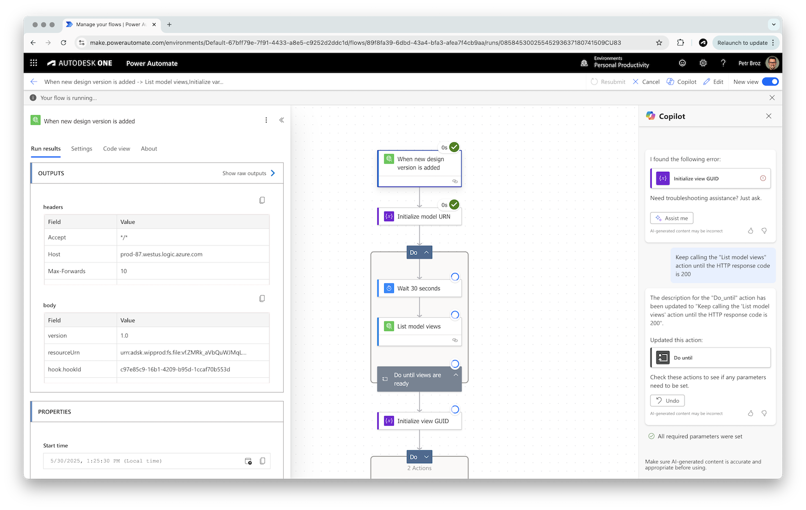

# APS Power Automate Tools

Collection of examples of [Microsoft Power Automate](https://www.microsoft.com/en-us/power-platform/products/power-automate) custom connectors for accessing [Autodesk Platform Services](https://aps.autodesk.com).

## Getting Started

For prerequisites and tutorials, please check out the [documentation](https://autodesk-platform-services.github.io/aps-power-automate-tools).

## Troubleshooting

Please contact us via https://aps.autodesk.com/get-help.

## License

This code is licensed under the terms of the [MIT License](http://opensource.org/licenses/MIT). Please see the [LICENSE](LICENSE) file for more details.