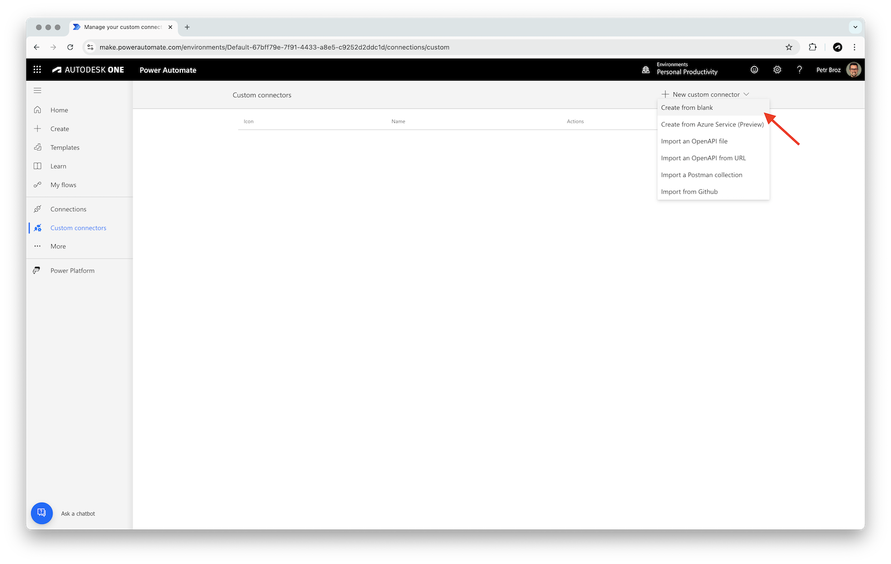
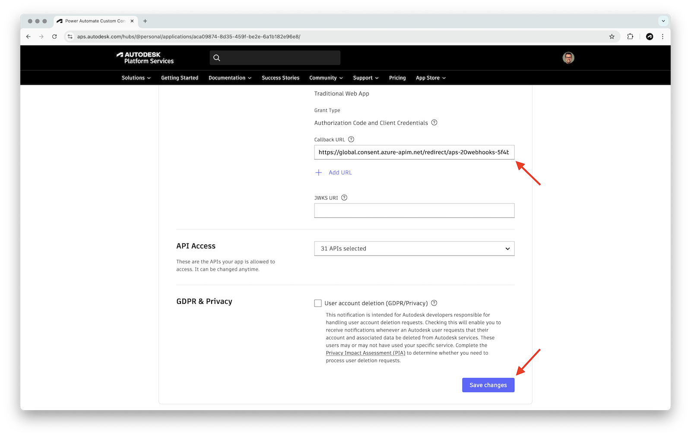

# Part 1: Auth & Triggers

In this part of the tutorial you will:

- Learn how to create a blank custom connector in Power Automate
- Configure OAuth 2.0 authentication for APS
- Add a webhook trigger that notifies Power Automate when a new design version is added in Autodesk Construction Cloud (ACC)
- Test the connector using a folder URN from ACC

## Create a connector

Let's start by creating a blank custom connector, and configure its authentication for access to Autodesk Platform Services.

- In Power Automate, go to **Custom connectors** in the left sidebar, and in the **New custom connector** dropdown in the top-right, select **Create from blank**



> Note: if you don't see **Custom connectors** in the sidebar, expand the **... More** dropdown in the same sidebar, and click **Discover all** to find and pin them:
> 

- In the **Create from blank** dialog, enter a name for the connector (for example, `MyAPS`), and click **Continue**
- In the **1. General** step, under **General information**, enter the following details:
  - **Scheme**: `HTTPS`
  - **Host**: `developer.api.autodesk.com`
  - **Base URL**: `/`
  - Optionally, specify the icon and description for your connector as well
- Click **Security** at the bottom-right to go to the next step


## Setup authentication

- In the **2. Security** step, set **Authentication type** to **OAuth 2.0**
- In the **OAuth 2.0** panel, enter the following details:
  - **Identity Provider**: **Generic Oauth 2**
  - **Client ID**: your APS client ID
  - **Client Secret**: your APS client secret
  - **Authorization URL**: `https://developer.api.autodesk.com/authentication/v2/authorize`
  - **Token URL**: `https://developer.api.autodesk.com/authentication/v2/token`
  - **Refresh URL**: `https://developer.api.autodesk.com/authentication/v2/token`
  - **Scope**: `data:read, data:write`
- Click **Create connector** in the top-right to save the connector


- After the connector has been created, copy the auto-generated **Redirect URL** at the very bottom of the **OAuth 2.0** panel (it should look something like this: `https://global.consent.azure-apim.net/redirect/...`), and register it as a callback URL for your APS application on https://aps.autodesk.com/myapps



## Add a trigger

Next, we'll add a _trigger_ to our custom connector which can later be used to trigger Power Automate flows. In our case the trigger will use [Webhooks API](https://aps.autodesk.com/en/docs/webhooks/v1/developers_guide/overview/) to create a webhook that will notify the Power Automate platform whenever a new design version is added in our Data Management service (see [dm.version.added](https://aps.autodesk.com/en/docs/webhooks/v1/reference/events/data_management_events/dm.version.added/)).

- Go to the **3. Definition** step in the connector configurator, and click **New trigger**


- In the **General** panel, enter the following details:
  - **Summary**: `When new design version is added`
  - **Description** (optional): `Create a webhook that triggers when new design version is added in the Data Management service.`
  - **Operation ID**: `createDataMgmtVersionAddedWebhook`
  - **Visibility**: **important**
  - **Trigger type**: **Webhook**


- In the **Request** section, click **Import from sample**
- In the **Import from sample** panel, enter the following details:
  - **Verb**: **POST**
  - **URL**: `https://developer.api.autodesk.com/webhooks/v1/systems/data/events/dm.version.added/hooks`
  - **Headers**: `Content-Type application/json`
  - **Body**: add the following payload example (a simplified version from the [documentation](https://aps.autodesk.com/en/docs/webhooks/v1/reference/http/webhooks/systems-system-events-event-hooks-POST/#example)):

```js
{
  "callbackUrl": "http://bf067e05.ngrok.io/callback",
  "scope": {
    "folder": "urn:adsk.wipprod:fs.folder:co.wT5lCWlXSKeo3razOfHJAw"
  }
}
```

- Click **Import**


- In the **Webhook Response** panel, set the **Description** to `New design version has been added.`, and click **Import from sample**
- In the **Import from sample** panel, enter the following details:
  - **Body**: add the following payload example (taken from the [dm.version.added](https://aps.autodesk.com/en/docs/webhooks/v1/reference/events/data_management_events/dm.version.added/) event documentation):

```js
{
  "version": "1.0",
  "resourceUrn": "urn:adsk.wipprod:fs.file:vf.0zvdp3CoTzWDcZC_wL0kJA?version=1",
  "hook": {
    "system": "data",
    "event": "dm.version.added",
    "hookId": "1fcd3e30-9f3f-11e7-951f-0fd5337ed5ce",
    "tenant": "urn:adsk.wipprod:fs.folder:co.s424tpjyS_yYBs5ozch94g",
    "callbackUrl": "http://bf067e05.ngrok.io/callback",
    "createdBy": "*************",
    "createdDate": "2017-09-22T02:38:32.341+0000",
    "creatorType": "Application",
    "filter": "$[?(@.ext=='txt')]",
    "hookAttribute": {
      "myfoo": 34,
      "projectId": "someURN",
      "myobject": {
        "nested": true
      }
    },
    "scope": {
      "folder": "urn:adsk.wipprod:fs.folder:co.s424tpjyS_yYBs5ozch94g"
    },
    "urn": "urn:adsk.webhooks:events.hook:1fcd3e30-9f3f-11e7-951f-0fd5337ed5ce",
    "status": "active",
    "__self__": "/systems/data/events/dm.version.added/hooks/1fcd3e30-9f3f-11e7-951f-0fd5337ed5ce"
  },
  "payload": {
    "ext": "txt",
    "modifiedTime": "2017-09-06T03:08:53+0000",
    "creator": "*************",
    "lineageUrn": "urn:adsk.wipprod:dm.lineage:0zvdp3CoTzWDcZC_wL0kJA",
    "sizeInBytes": 36,
    "hidden": false,
    "indexable": true,
    "project": "4f8b8b74-3853-473d-85c4-4e8a8bff885b",
    "source": "urn:adsk.wipprod:fs.file:vf.0zvdp3CoTzWDcZC_wL0kJA?version=1",
    "version": "1",
    "user_info": {
      "id": "*************"
    },
    "name": "dc829fc5-bd21-4444-8d8f-735ae4fe736f.txt",
    "createdTime": "2017-09-06T03:08:53+0000",
    "modifiedBy": "*************",
    "state": "CONTENT_AVAILABLE",
    "parentFolderUrn": "urn:adsk.wipprod:fs.folder:co.chOa5mlkR6mjN-PEx8-r8Q",
    "ancestors": [
      {
        "urn": "urn:adsk.wipprod:fs.folder:co.woxoClweRCeMWn-HFbXGdQ",
        "name": "b662c88c-85e3-45c7-a9cc-6c77a31462a4"
      },
      {
        "urn": "urn:adsk.wipprod:fs.folder:co.XFrPsQGxRomOJzyL1-z7Tg",
        "name": "292139e5-5f7f-402c-90f0-e61b53f38aad-account-root-folder"
      },
      {
        "urn": "urn:adsk.wipprod:fs.folder:co.6a5Ylw9mRDus2bhttmH7dw",
        "name": "4f8b8b74-3853-473d-85c4-4e8a8bff885b-root-folder"
      },
      {
        "urn": "urn:adsk.wipprod:fs.folder:co.bXJiDx2ySve30xhul5Ihuw",
        "name": "Project Files"
      },
      {
        "urn": "urn:adsk.wipprod:fs.folder:co.chOa5mlkR6mjN-PEx8-r8Q",
        "name": "SomeTest"
      }
    ],
    "tenant": "292139e5-5f7f-402c-90f0-e61b53f38aad"
  }
}
```

- Click **Import**


- In the **Trigger configuration** panel, set the **Callback URL parameter** to **callbackUrl**


- Go back to the **Request** panel at the top of the page
- In the **Request > Headers** section, click the **Content-Type** dropdown, and select **Edit**
- Update the following parameter details:
  - **Default value**: `application/json`
  - **Is required?**: **Yes**
  - **Visibility**: **internal**
- Go back to the trigger configuration by clicking the **Back** link at the top


- In the **Request > Body** section, click the **body** dropdown, and select **Edit**
- Update the following parameter details:
  - **Name** (optional): `Webhook Definition`
  - **Is required?**: **Yes**
  - **Visibility**: **important**


- Click the **callbackUrl** dropdown, and select **Edit**
- Update the following parameter details:
  - **Title**: `Callback URL`
  - **Description** (optional): `URL to be called by the webhook when it triggers.`
  - **Is required?**: **Yes**
  - **Visibility**: **internal**
- Go back to the body parameter configuration by clicking the **Back** link at the top


- Similarly, click the **folder** dropdown, and select **Edit**
- Update the following parameter details:
  - **Title**: `Folder URN`
  - **Description** (optional): `URN of folder to observe for changes.`
  - **Is required?**: **Yes**
  - **Visibility**: **important**
- Go back to the body parameter configuration by clicking the **Back** link at the top


- Save the configured trigger by clicking the **Update connector** button in the top-right

## Test the connector

Now that we have a usable trigger in our custom connector, let's try it out.

> ### Tip: Callback URL
>
> For this test we will need a _callback URL_ - a URL for the Webhook service to call when certain event happens. For simple experiments you can use 3rd party websites such as https://webhook.site:
>
> - Go to https://webhook.site
> - Copy the auto-generated URL from **Your unique URL**
> - Keep the website open as you can later use it to inspect the incoming calls
>
> 

> ### Tip: Folder URN
>
> For this test we will also need a _URN_ of a folder in ACC that will be monitored for changes. For simple experiments you can get the folder URN from https://acc.autodesk.com:
>
> - Go to your ACC project, and select the folder you want to monitor
> - Grab the **folderUrn** query parameter from the URL
> - URL-decode it, for example, using https://www.urldecoder.org
> - The decoded URN should look something like this: `urn:adsk.wipprod:fs.folder:...`
>
> 

- Go to the **6. Test** step in the connector configurator
- If you don't have an existing connection in the **Connections** panel, click **New connection**, and login with your Autodesk credentials
- In the **Operations** section, select **createDataMgmtVersionAddedWebhook**, and specify the following inputs:
  - **callbackUrl**: a callback URL for the webhook
  - **scope.folder**: URN of the folder in ACC to observe for changes
- Finally, click **Test operation**


- You should get a `200 OK` response with the details of the new webhook
- Go to your ACC project, and upload any kind of file to the same folder you've configured in the trigger
- If you used https://webhook.site, you should see the notification from APS there

