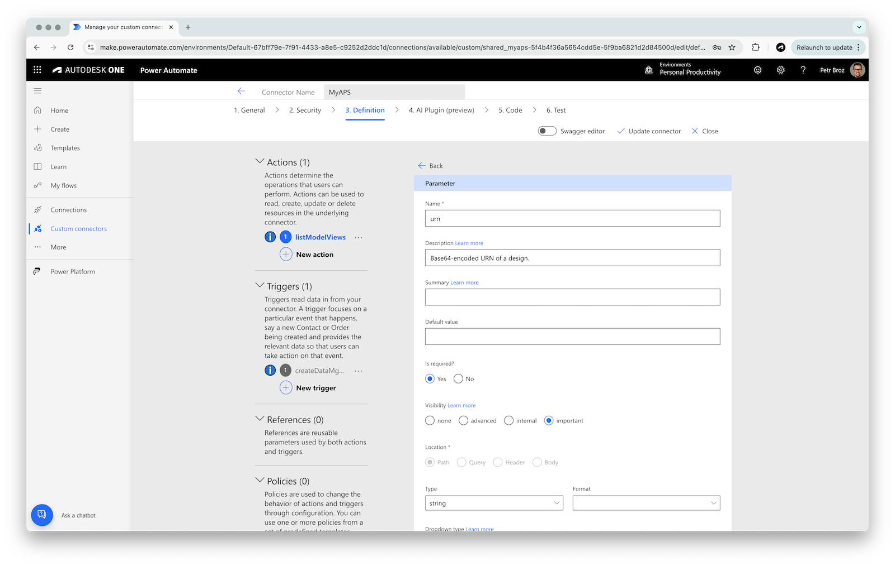

# Part 2: Model Derivative Actions

In this part of the tutorial you will:

- Add actions to the connector for interacting with the [Model Derivative](https://aps.autodesk.com/en/docs/model-derivative/v2/developers_guide/overview) service
- Create an action to [list all model views](https://aps.autodesk.com/en/docs/model-derivative/v2/reference/http/metadata/urn-metadata-GET/) for a given design
- Create an action to [list element properties](https://aps.autodesk.com/en/docs/model-derivative/v2/reference/http/metadata/urn-metadata-guid-properties-GET/) for a specific model view
- Test these actions using a model URN and a view GUID from ACC

## List model views

- Go to the **3. Definition** step in the connector configurator, and click **New action**


- In the **General** panel, enter the following details:
  - **Summary**: `List model views`
  - **Description** (optional): `List all views available for a specific model in APS Model Derivative service.`
  - **Operation ID**: `listModelViews`
  - **Visibility**: **important**


- In the **Request** section, click **Import from sample**
- In the **Import from sample** panel, enter the following details:
  - **Verb**: **GET**
  - **URL**: `https://developer.api.autodesk.com/modelderivative/v2/designdata/{urn}/metadata`
- Click **Import**


- In the **Request** panel, click the **urn** dropdown, and select **Edit** to configure this parameter
- In the **Parameter** panel:
  - Update the following parameter details:
    - **Name**: `urn` (must be the same as in the URL)
    - **Description** (optional): `Base64-encoded URN of a design.`
    - **Is required?**: **Yes**
    - **Visibility**: **important**
  - Go back to the action configuration by clicking the **Back** link at the top



- In the **Response** panel, select the **default** response
- In the response configuration panel, click **Import from sample**
- In the **Import from sample** panel, enter the following details:
  - **Body**: add the following payload example (taken from the [documentation](https://aps.autodesk.com/en/docs/model-derivative/v2/reference/http/metadata/urn-metadata-GET)):

```js
{
  "data": {
    "type": "metadata",
    "metadata": [
      {
        "name": "NAVISWORKS/IFC EXPORT",
        "role": "3d",
        "guid": "04b9a71d-9015-0a7b-338b-8522a705a8d7"
      },
      {
        "name": "New Construction",
        "role": "3d",
        "guid": "1d6e48c5-e4a4-8ca5-5b02-3f2acc354470",
        "isMasterView": true
      },
      {
        "name": "001 - 4128-AA-DC-681100**_IS01",
        "role": "2d",
        "guid": "eea006f7-042b-c298-d497-9ef4047e8378"
      }
    ]
  }
}
```

- Click **Import**


- Go back to the action configuration by clicking the **Back** link at the top
- Save the configured action by clicking the **Update connector** button at the top

## List element properties

- While still in the **3. Definition** step in the connector configurator, click **New action** again
- In the **General** panel, enter the following details:
  - **Summary**: `List element properties`
  - **Description** (optional): `List element properties for a specific model in APS Model Derivative service.`
  - **Operation ID**: `listElementProperties`
  - **Visibility**: **important**


- In the **Request** section, click **Import from sample**
- In the **Import from sample** panel, enter the following details:
  - **Verb**: **GET**
  - **URL**: `https://developer.api.autodesk.com/modelderivative/v2/designdata/{urn}/metadata/{modelGuid}/properties`
- Click **Import**


- In the **Response** panel, select the **default** response
- In the response configuration panel, click **Import from sample**
- In the **Import from sample** panel, enter the following details:
  - **Body**: add the following payload example (simplified version taken from the [documentation](https://aps.autodesk.com/en/docs/model-derivative/v2/reference/http/metadata/urn-metadata-guid-properties-GET)):

```js
{
  "data": {
    "type": "properties",
    "collection": [
      {
        "objectid": 1,
        "name": "A5",
        "externalId": "mou0zG8ViUOsqUzhb4TUiA",
        "properties": {}
      },
      {
        "objectid": 2,
        "name": "Model",
        "externalId": "z4u0zG8ViUOsqUzhb4TUiA",
        "properties": {}
      },
      {
        "objectid": 3,
        "name": "Bottom",
        "externalId": "0Yu0zG8ViUOsqUzhb4TUiA",
        "properties": {}
      },
      {
        "objectid": 4,
        "name": "Box",
        "externalId": "1Iu0zG8ViUOsqUzhb4TUiA",
        "properties": {}
      }
    ]
  }
}
```

- Click **Import**


- Go back to the action configuration by clicking the **Back** link at the top
- Save the configured action by clicking the **Update connector** button at the top

## Test the connector

> ### Tip: Model URN
>
> For this test we will need a _model URN_ (a base64-encoded ID of a design stored in our Data Management service). For simple experiments you can get the URN from https://acc.autodesk.com:
>
> - Go to your ACC project, and open one of the designs
> - Open the developer console in your browser (`Ctrl+Shift+J` on Windows/Linux, or `Cmd+Option+J` on Mac)
> - Execute the following command in the console: `NOP_VIEWER.model.getData().urn`
> - Copy the URN (without the quotes)
>
> 

- Go to the **6. Test** step in the connector configurator
- If you don't have an existing connection in the **Connections** panel, click **New connection**, and login with your Autodesk credentials

### List model views

- In the **Operations** section, select **listModelViews**, and specify the following inputs:
  - **urn**: your model URN
- Finally, click **Test operation**


- The test operation should succeed, giving you a list of model views
- Make note of one of the view GUIDs - we will use them in the next test


### List element properties

- In the **Operations** section, select **listElementProperties**
- In the **listElementProperties** panel, specify the following inputs:
  - **urn**: your model URN
  - **modelGuid**: GUID of a model view retrieved from the previous test
- Finally, click **Test operation**


- The test operation should succeed, giving you a list of all element properties

> Note: in case you get a `202` response code, the properties are still being extracted from the design; try running the test again after a while

