# Part 3: ACC Issues Actions

In this part of the tutorial you will:

- Add actions to the connector for managing [ACC Issues](https://aps.autodesk.com/en/docs/acc/v1/tutorials/issues/)
- Create an action to [list all available issue types](https://aps.autodesk.com/en/docs/acc/v1/reference/http/issues-issue-types-GET/) for an ACC project
- Create an action to [create a new issue](https://aps.autodesk.com/en/docs/acc/v1/reference/http/issues-issues-POST/) for an ACC project
- Test these actions using your ACC project ID

## List issue types

- Go to the **3. Definition** step in the connector configurator, and click **New action**

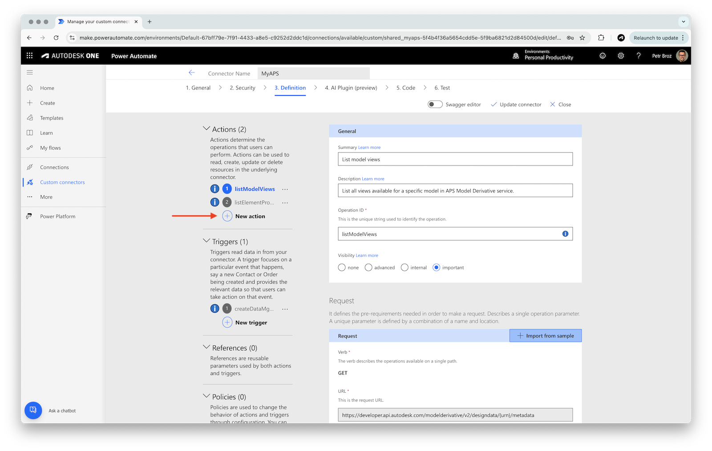

### General configuration

- In the **General** panel, enter the following details:
  - **Summary**: `List issue types`
  - **Description** (optional): `List all available issue types in an ACC project.`
  - **Operation ID**: `listIssueTypes`
  - **Visibility**: **important**

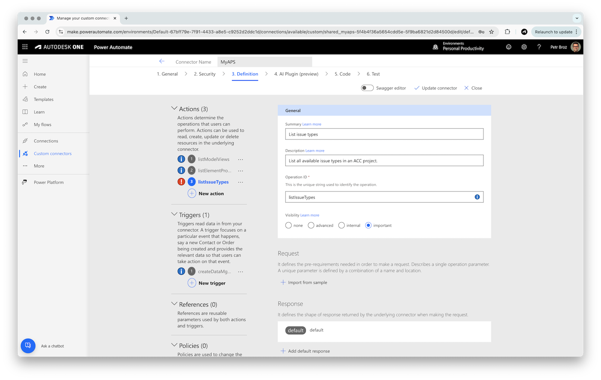

### Request configuration

- In the **Request** section, click **Import from sample**
- In the **Import from sample** panel, enter the following details:
  - **Verb**: **GET**
  - **URL**: `https://developer.api.autodesk.com/construction/issues/v1/projects/{projectId}/issue-types?include=subtypes`
- Click **Import**

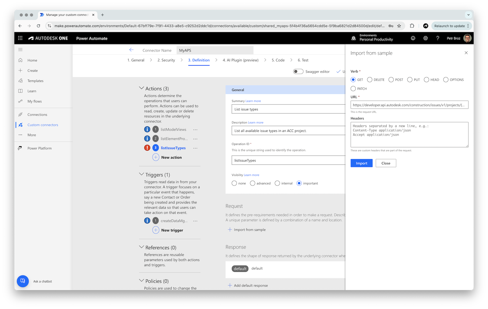

#### Parameter configuration: project ID

- In the **Request** panel, click the **projectId** dropdown, and select **Edit** to configure this parameter
- In the **Parameter** panel, update the following details:
  - **Name**: `projectId` (must be the same as in the URL)
  - **Description** (optional): `ACC project to retrieve issue types from.`
  - **Is required?**: **Yes**
  - **Visibility**: **important**
- Go back to the action configuration by clicking the **Back** link at the top

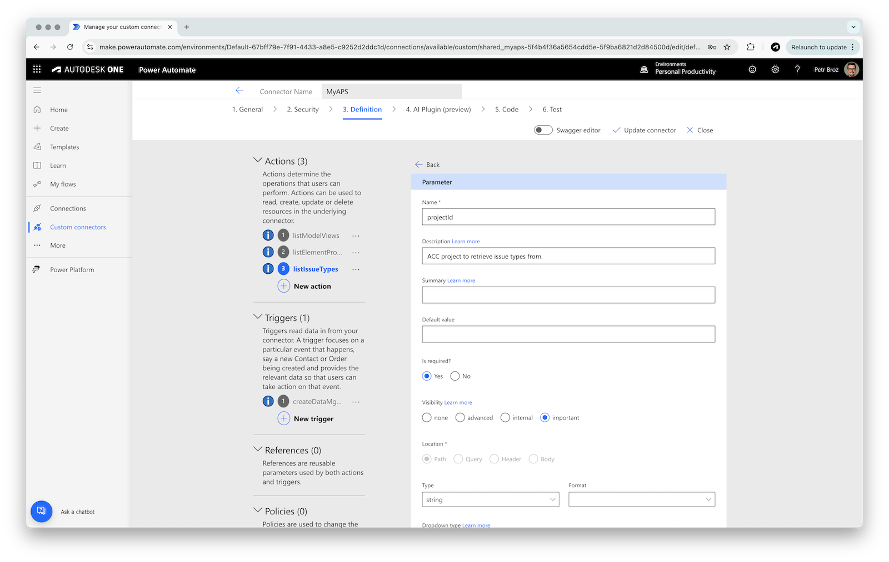

#### Parameter configuration: include subtypes

- In the **Request** panel, click the **include** dropdown, and select **Edit** to configure this parameter
- In the **Parameter** panel, update the following details:
  - **Name**: `include`
  - **Default value**: `subtypes`
  - **Is required?**: **No**
  - **Visibility**: **advanced**
- Go back to the action configuration by clicking the **Back** link at the top

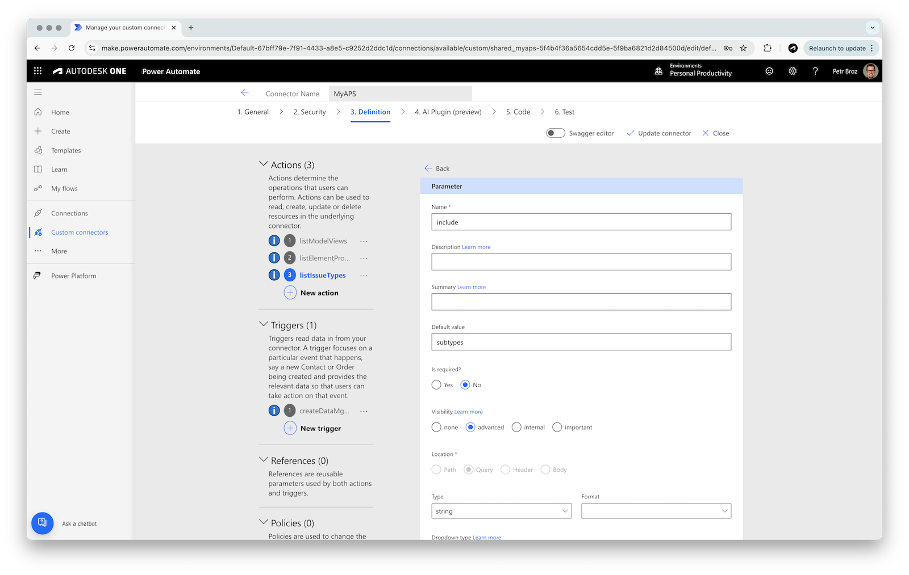

### Response configuration

- In the **Response** panel, select the **default** response
- In the response configuration panel, click **Import from sample**
- In the **Import from sample** panel, enter the following details:
  - **Body**: add the following payload example (taken from the [documentation](https://aps.autodesk.com/en/docs/acc/v1/reference/http/issues-issue-types-GET/)):

```js
{
  "pagination": {
    "limit": 10,
    "offset": 100,
    "totalResults": 25
  },
  "results": [
    {
      "id": "1110f111-6c54-4b01-90e6-d701748f1111",
      "containerId": "a5f49f04-59bb-477c-97e6-6833cb50bdac",
      "title": "Coordination",
      "isActive": true,
      "orderIndex": 2,
      "permittedActions": [
        "edit"
      ],
      "permittedAttributes": [
        "title"
      ],
      "subtypes": [
        {
          "id": "2220f222-6c54-4b01-90e6-d701748f0222",
          "issueTypeId": "1110f111-6c54-4b01-90e6-d701748f1111",
          "title": "Clash",
          "code": "exo",
          "isActive": true,
          "orderIndex": 5,
          "isReadOnly": false,
          "permittedActions": [
            "edit"
          ],
          "permittedAttributes": [
            "title"
          ],
          "createdBy": "A3RGM375QTZ7",
          "createdAt": "2018-07-22T15:05:58.033Z",
          "updatedBy": "A3RGM375QTZ7",
          "updatedAt": "2018-07-22T15:05:58.033Z",
          "deletedBy": "A3RGM375QTZ7",
          "deletedAt": "2018-07-22T15:05:58.033Z"
        }
      ],
      "statusSet": "gg",
      "createdBy": "A3RGM375QTZ7",
      "createdAt": "2018-07-22T15:05:58.033Z",
      "updatedBy": "A3RGM375QTZ7",
      "updatedAt": "2018-07-22T15:05:58.033Z",
      "deletedBy": "A3RGM375QTZ7",
      "deletedAt": "2018-07-22T15:05:58.033Z"
    }
  ]
}
```

- Click **Import**

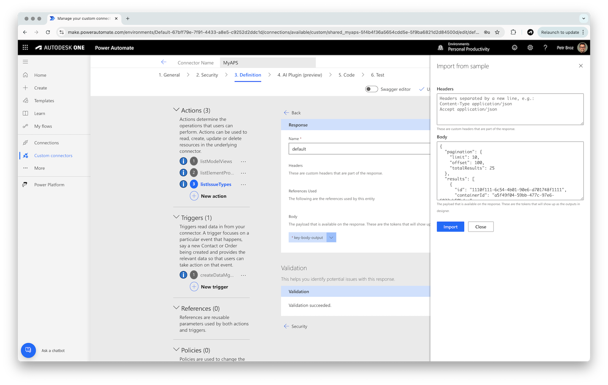

- Go back to the action configuration by clicking the **Back** link at the top
- Save the configured action by clicking the **Update connector** button at the top

## Create issue

- While still in the **3. Definition** step in the connector configurator, click **New action**

### General configuration

- In the **General** panel, enter the following details:
  - **Summary**: `Create issue`
  - **Description** (optional): `Create a new issue in an ACC project.`
  - **Operation ID**: `createIssue`
  - **Visibility**: **important**

### Request configuration

- In the **Request** section, click **Import from sample**
- In the **Import from sample** panel, enter the following details:
  - **Verb**: **POST**
  - **URL**: `https://developer.api.autodesk.com/construction/issues/v1/projects/{projectId}/issues`
  - **Headers**: `Content-Type application/json`
  - **Body**: add the following payload example (a simplified version taken from the [documentation](https://aps.autodesk.com/en/docs/acc/v1/reference/http/issues-issues-POST/#example)):

```js
{
  "title": "Door missing a screw.",
  "description": "The door is missing a screw. Please fix this.",
  "issueSubtypeId": "1370f222-6c54-3a01-93e6-e701749f0222",
  "status": "open",
  "assignedTo": "A3RGM375QTZ7",
  "assignedToType": "user",
  "dueDate": "2018-07-25",
  "startDate": "1982-06-01",
  "locationId": "35de6f24-39f5-4808-ba5f-6cbbe2a858e1",
  "locationDetails": "issue location details",
  "rootCauseId": "2370f222-6c54-3a01-93e6-f701772f0222",
  "published": true
}
```

- Click **Import**

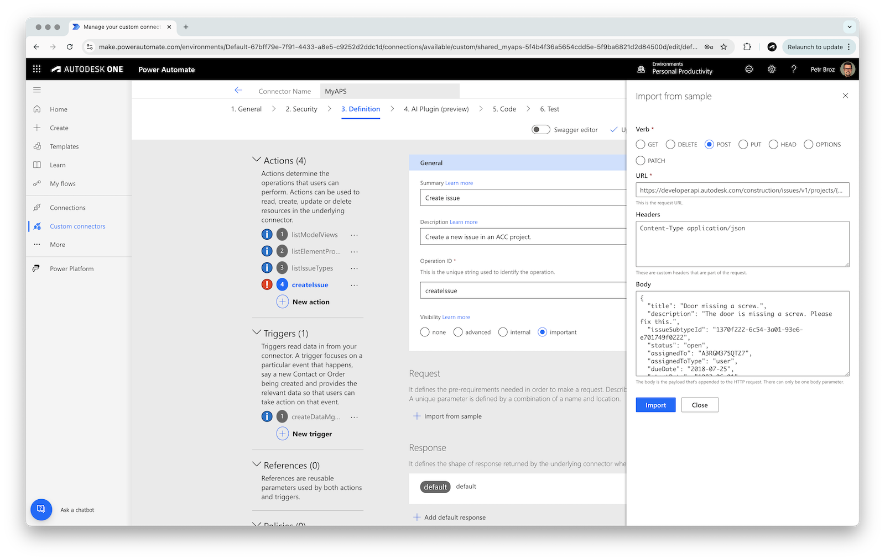

#### Parameter configuration: project ID

- In the **Request** panel, click the **projectId** dropdown, and select **Edit** to configure this parameter
- In the **Parameter** panel, update the following details:
  - **Name**: keep `projectId` (must be the same as in the URL)
  - **Is required?**: **Yes**
  - **Visibility**: **important**
- Go back to the action configuration by clicking the **Back** link at the top


#### Parameter configuration: content type

- In the **Request** panel, click the **Content-Type** dropdown, and select **Edit** to configure this parameter
- In the **Parameter** panel, update the following details:
  - **Name**: keep `Content-Type`
  - **Default value**: `application/json`
  - **Is required?**: **Yes**
  - **Visibility**: **internal**
- Go back to the action configuration by clicking the **Back** link at the top

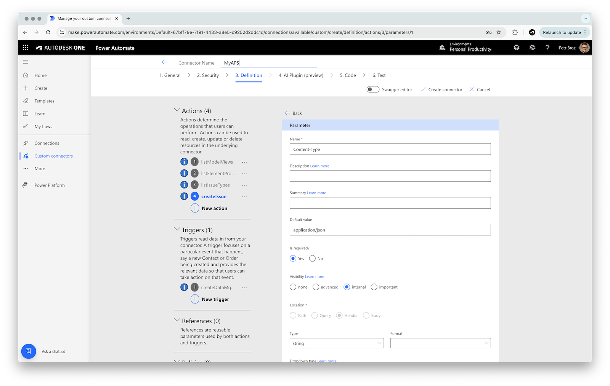

#### Parameter configuration: issue title, subtype ID, status

- In the **Request** panel, click the **body** dropdown, and select **Edit** to configure this parameter
- In the **Parameter** panel, update the following details:
  - **Name**: `Issue Definition`
  - **Is required?**: **Yes**
  - **Visibility**: **important**
- Edit the the **title**, **issueSubtypeId**, and **status** fields of the body with the following:
  - **Is required?**: **Yes**
  - **Visibility**: **important**
- For the **status** field, change the **Dropdown type** to **Static**, and set **Values** to `draft,open,pending,in_progress,completed,in_review,not_approved,in_dispute,closed`

[Create issue: body parameter config](images/create-issue-param-body.webm ':include :type=video controls width=100%')

- Go back to the action configuration by clicking the **Back** link at the top

### Response configuration

- In the **Response** panel, select the **default** response
- In the response configuration page, click **Import from sample**
- In the **Import from sample** panel, enter the following details:
  - **Body**: add the following payload example (taken from the [POST issues](https://aps.autodesk.com/en/docs/acc/v1/reference/http/issues-issues-POST/#example) documentation):

```js
{
  "id": "3570f222-6c54-4b01-90e6-e701749f0222",
  "containerId": "2220f222-6c54-4b01-90e6-d701748f0222",
  "deleted": false,
  "deletedAt": "2018-07-22T15:05:58.033Z",
  "deletedBy": "A3RGM375QTZ7",
  "displayId": 7,
  "title": "Door missing a screw.",
  "description": "The door is missing a screw. Please fix this.",
  "snapshotUrn": "",
  "issueTypeId": "8770f222-6c54-4e01-93e6-e701749f0222",
  "issueSubtypeId": "1370f222-6c54-3a01-93e6-e701749f0222",
  "status": "open",
  "assignedTo": "A3RGM375QTZ7",
  "assignedToType": "user",
  "dueDate": "2018-07-25",
  "startDate": "1982-06-01",
  "locationId": "35de6f24-39f5-4808-ba5f-6cbbe2a858e1",
  "locationDetails": "issue location details",
  "linkedDocuments": [
    {
      "type": "TwoDVectorPushpin",
      "urn": "urn:adsk.wipprod:dm.lineage:0C9edNQuT2SrfoyKQ1Gv_Q",
      "createdBy": "A3RGM375QTZ7",
      "createdAt": "2018-07-22T15:05:58.033Z",
      "createdAtVersion": 1,
      "closedBy": "A3RGM375QTZ7",
      "closedAt": "2018-08-22T15:05:58.033Z",
      "closedAtVersion": 1,
      "details": {
        "viewable": {
          "id": "24820322-7c54-4a01-93e6-e701749f0345",
          "guid": "24820322-7c54-4a01-93e6-e701749f0345",
          "viewableId": "42",
          "name": "3D view of the 3rd floor of the building",
          "is3D": true
        },
        "position": {
          "x": -0.35907751666652,
          "y": 0.23,
          "z": 0.9998
        },
        "objectId": 3,
        "externalId": "4",
        "viewerState": true
      }
    }
  ],
  "links": [
    {}
  ],
  "ownerId": "",
  "rootCauseId": "2370f222-6c54-3a01-93e6-f701772f0222",
  "officialResponse": {},
  "issueTemplateId": "",
  "permittedStatuses": [
    "open"
  ],
  "permittedAttributes": [
    "title"
  ],
  "published": true,
  "permittedActions": [
    "add_comment"
  ],
  "commentCount": 3,
  "attachmentCount": 0,
  "openedBy": "A3RGM375QTZ7",
  "openedAt": "2018-07-22T15:05:58.033Z",
  "closedBy": "A3RGM375QTZ7",
  "closedAt": "2018-07-22T15:05:58.033Z",
  "createdBy": "A3RGM375QTZ7",
  "createdAt": "2018-07-22T15:05:58.033Z",
  "updatedBy": "A3RGM375QTZ7",
  "updatedAt": "2018-07-22T15:05:58.033Z",
  "watchers": [
    "A3RGM375QTZ7"
  ],
  "customAttributes": [
    {
      "attributeDefinitionId": "2220f222-6c54-4b01-90e6-d701748f0888",
      "value": "368",
      "type": "numeric",
      "title": "Cost Impact ($)"
    }
  ],
  "gpsCoordinates": {
    "latitude": 35.7795897,
    "longitude": -78.6381787
  },
  "snapshotHasMarkups": false
}
```

- Click **Import**
- Go back to the action configuration by clicking the **Back** link at the top
- Save the configured action by clicking the **Update connector** button at the top

## Test the connector

Now that we have a custom connector with a couple of actions, let's try them out.

> ### Tip: Retrieving project ID
>
> For the following tests we will need an ID of our project in ACC. For simple experiments you can get the ID from https://acc.autodesk.com:
>
> - Go to your ACC project, and navigate to the **Issues** section
> - Grab the project ID from the URL
>
> 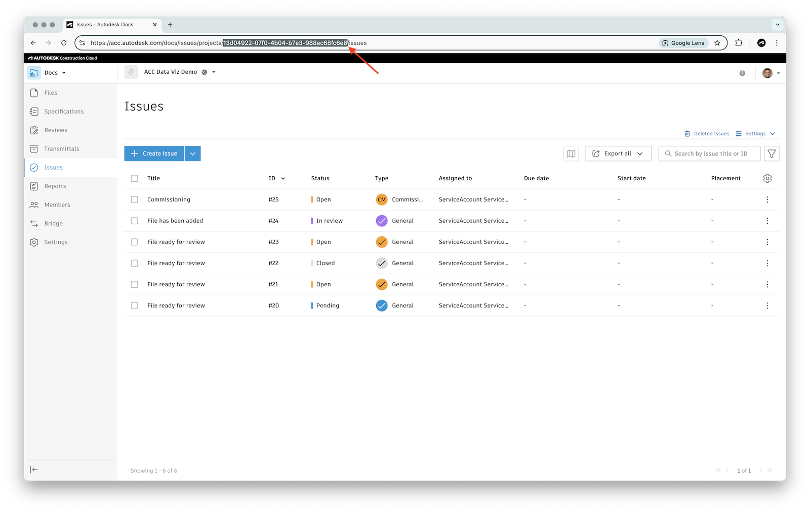

- Go to the **6. Test** step in the connector configurator
- If you don't have an existing connection in the **Connections** panel, click **New connection**, and login with your Autodesk credentials

### List issue types

- In the **Operations** section, select **listIssueTypes**, and specify the following inputs:
  - **projectId**: your ACC project ID
  - **include**: `subtypes`
- Finally, click **Test operation**

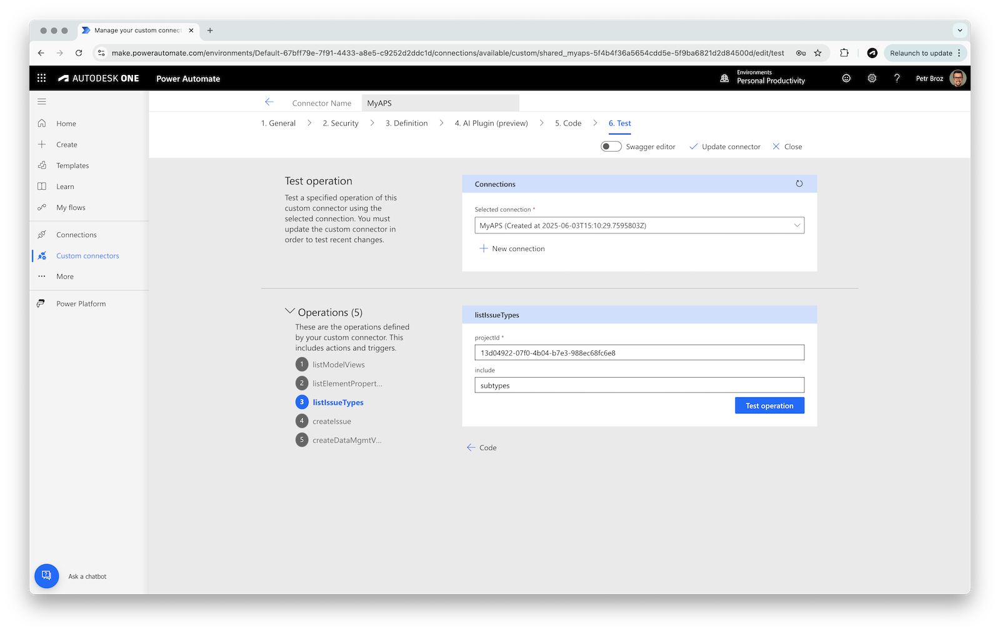

- The test operation should succeed, giving you a list of issue types and subtypes
- Make note of one of the issue subtype IDs - we will use them in the next test

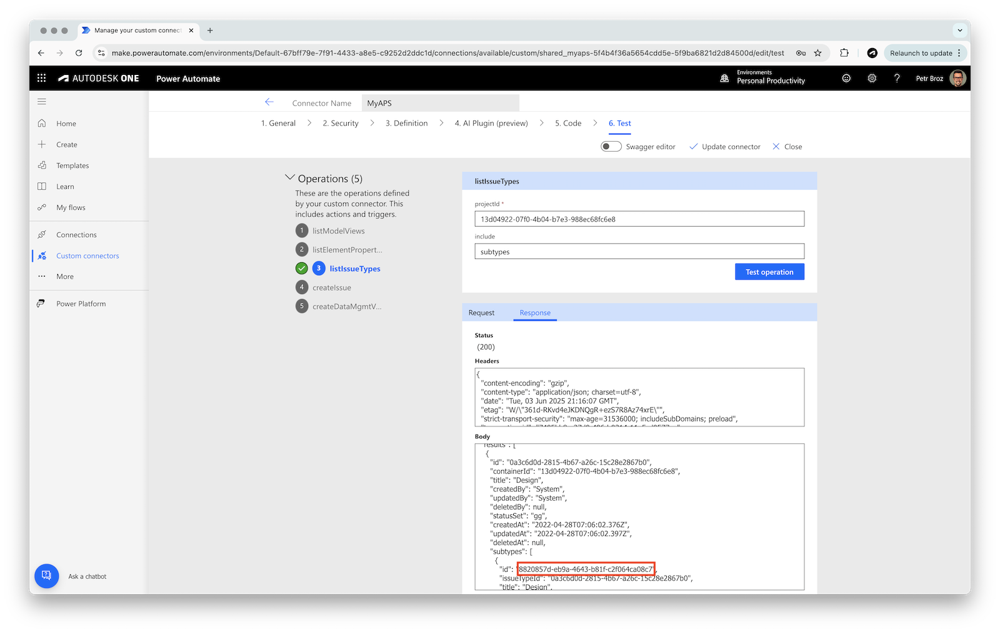

### Create an issue

- In the **Operations** section, select **createIssue**, and specify the following inputs:
  - **projectId**: your ACC project ID
  - **title**: `Test issue from Power Automate`
  - **issueSubtypeId**: ID of an issue subtype you retrieved in the previous test
  - **status**: `open`
- Finally, click **Test operation**

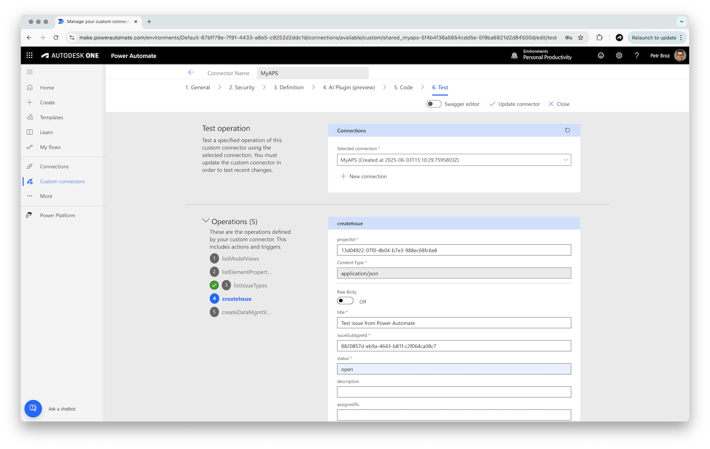

- The test operation should succeed, returning the details of the newly created issue

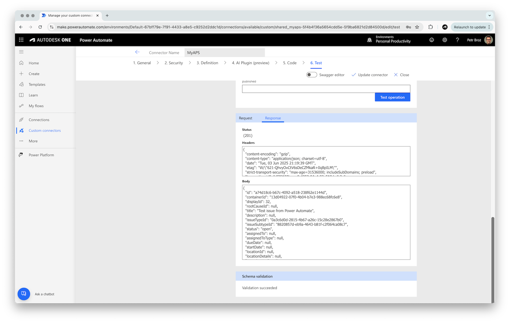

- Finally, you should also see the issue in your ACC project

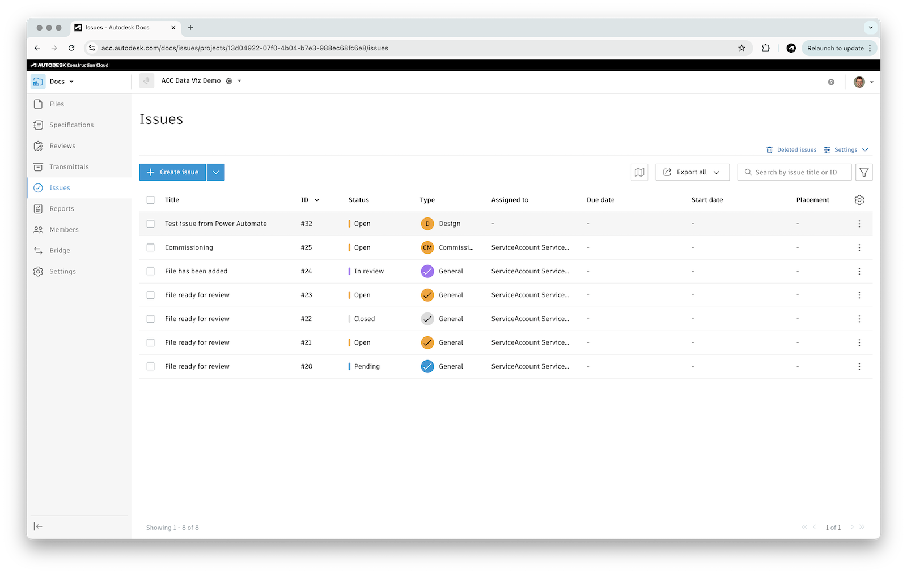