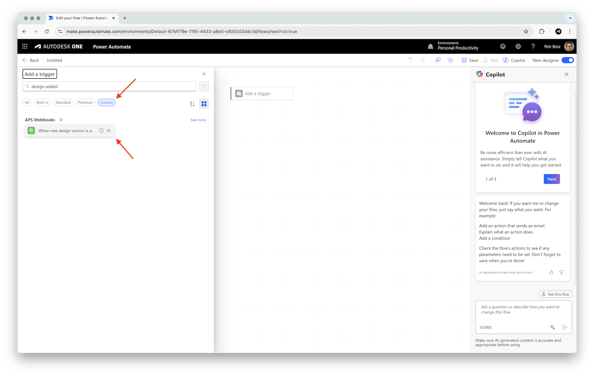
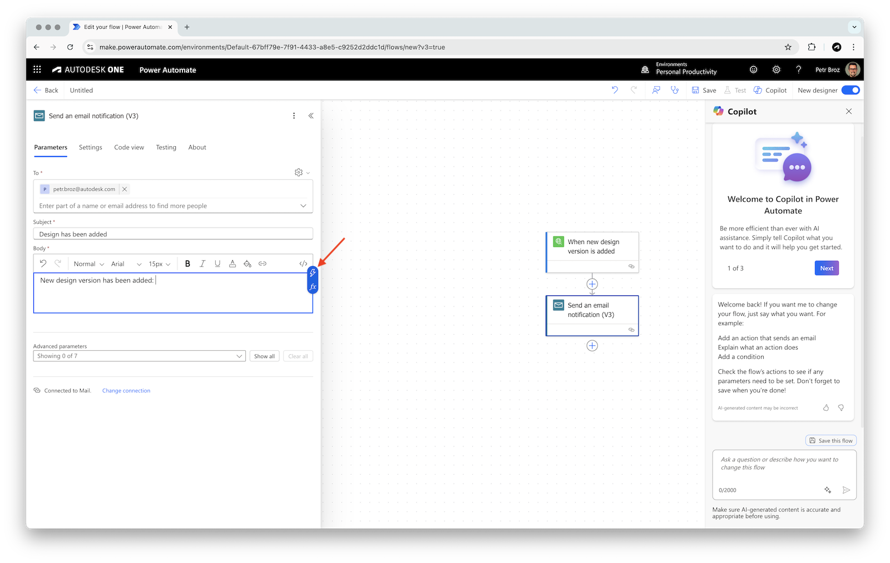

# Create Simple Flow

In this tutorial, we will walk through the process of creating a simple automated flow in Power Automate that sends an email notification whenever a new design version is added to a specific folder in Autodesk Construction Cloud. You'll learn how to set up the trigger, configure the action, and test your flow to ensure it works as expected.

!> This tutorial assumes that you have already created or imported the custom connectors for APS described in previous tutorials.

## Create an automated flow

- In Power Automate, create a new flow by clicking **Create** in the left sidebar, and selecting **Automated cloud flow**

> Note: if a **Build an automated cloud flow** dialog pops up, click **Skip** to go straight to the flow designer.

## Add a trigger

- In the flow designer, click on the **Add a trigger** block
- In the **Add a trigger** panel that slides in from the left, search for `design added`, set the filter under the search field to **Custom**, and select the **When new design version is added** trigger

> Note: if this is the first time you're using the custom connector, Power Automate will ask you to sign in. Click **Sign in**, and log in with your Autodesk account.

- In the **When new design version is added** configuration panel, add the following details:
  - **Folder URN**: a URN of one of your folders in ACC

    > Tip: if you don't have one, go to your ACC project, navigate to one of the folders, grab the **folderUrn** query parameter from the URL, and url-decode it (for example, using https://www.urldecoder.org); the url-decoded folder URN should look something like this: `urn:adsk.wipprod:fs.folder:...`
    >
    > 

## Add an action

- Click on the plus icon under the trigger to add an action
- In the **Add an action** panel that slides in from the left, search for `email`
- Select the **Send an email notification (V3)** action

- In the **Send an email notification (V3)** configuration panel, add the following details:
  - **To**: your e-mail address
  - **Subject**: `Design has been added`
  - **Body**: `New design version has been added: `
- With the cursor still in the **Body** text field, click the little lightning bolt icon (or type in `/`) to add dynamic content

- In the popup, search for `name`, and select **body/payload/name**, effectively extracting the name of the new design from our trigger

- Click **Save** in the top-right to save the flow, and then **Back** in the top-left to go back to the flow overview

## Try the flow

Go to your ACC project, upload a file to the folder you've configured in the trigger, and an e-mail should arrive shortly after.

> Note: if you haven't received the e-mail, check the **Flow runs** in your flow overview page. If the flow run failed, open it (by clicking the timestamp of the run), and investigate the individual steps of the flow.
> 