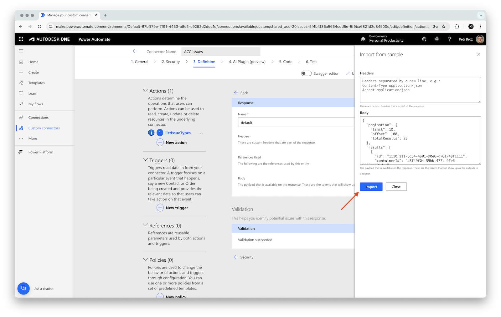
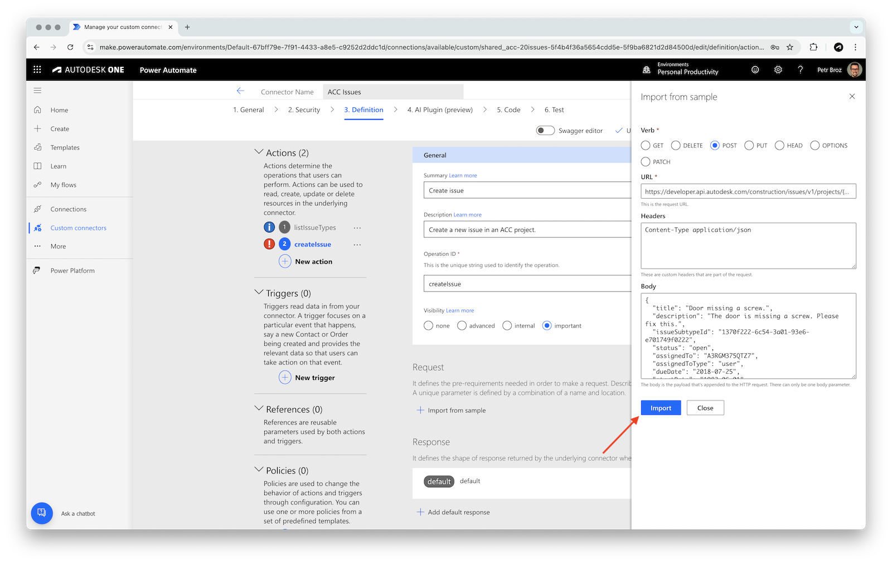

# Create Connector for ACC Issues

In this tutorial, we will create a custom Power Automate connector for Autodesk Platform Services [ACC Issues API](https://aps.autodesk.com/en/docs/acc/v1/reference/http/issues-issues-GET/). You'll learn how to:

- Set up a new custom connector from scratch in Power Automate
- Configure OAuth 2.0 authentication for secure access to APS APIs
- Add actions to list issue types and create new issues in an ACC project
- Test your connector directly within the configurator interface

By the end, you'll have a working connector that can be used in your Power Automate flows to interact with ACC issues.

> ### Sidenote
>
> #### Why not just import OpenAPI specs?
>
> As we go through the process of creating custom connectors, you'll see that Power Automate provides ways to _generate_ connectors from existing definitions, for example, from OpenAPI specs or Postman collections. While we _do_ provide [OpenAPI specs](https://aps.autodesk.com/blog/openapi-specs-are-here) and [Postman collections](https://github.com/autodesk-platform-services/aps-postman-collections) for APS, the automated connector generation has various limitations, for example:
>
> - According to the [custom connectors docs](https://learn.microsoft.com/en-us/connectors/custom-connectors/define-openapi-definition), when importing OpenAPI specifications, only the _OpenAPI 2.0_ format (formerly known as _Swagger_) is supported
>   - Downgrading OpenAPI 3.0 to OpenAPI 2.0 is not trivial
> - According to an [announcement from October 2022](https://learn.microsoft.com/en-us/power-platform-release-plan/2022wave1/power-platform-pro-development/openapi-3-support-custom-connectors), _OpenAPI 3.0_ is also supported
>   - Apparently, when importing an OpenAPI 3.0 specification, Power Automate attempts to downgrade it to OpenAPI 2.0
>   - Unfortunately we've often seen this process fail or generate invalid output
> - When importing Postman collections, some information is lost or changed during the process
>   - For example, response fields that should be numbers are turned to strings, causing validation errors during runtime
> - There are important [extensions](https://learn.microsoft.com/en-us/connectors/custom-connectors/openapi-extensions) that still need to be added to the specification to make the best use of the Power Automate capabilities
>
> Because of these limitations, this tutorial currently focuses on creating Power Automate connectors from scratch.

## Create a connector

Let's start by creating a blank custom connector, and configure its authentication for access to Autodesk Platform Services.

- In Power Automate, go to **Custom connectors** in the left sidebar, and in the **New custom connector** dropdown in the top-right, select **Create from blank**


> Note: if you don't see **Custom connectors** in the sidebar, use the **Discover all** button (under the **... More** sidebar menu) to find and pin them:
> 

- In the **Create from blank** dialog, enter a name for the connector (for example, `ACC Issues`), and click **Continue**
- In the **1. General** step, under **General information**, enter the following details:
  - **Scheme**: `HTTPS`
  - **Host**: `developer.api.autodesk.com`
  - **Base URL**: `/construction/issues/v1`
  - Optionally, specify the icon and description for your connector as well
- Click **Security** at the bottom-right to go to the next section


## Setup authentication

- In the **2. Security** step, set **Authentication type** to **OAuth 2.0**
- In the **OAuth 2.0** panel, enter the following details:
  - **Identity Provider**: **Generic Oauth 2**
  - **Client ID**: your APS client ID
  - **Client Secret**: your APS client secret
  - **Authorization URL**: `https://developer.api.autodesk.com/authentication/v2/authorize`
  - **Token URL**: `https://developer.api.autodesk.com/authentication/v2/token`
  - **Refresh URL**: `https://developer.api.autodesk.com/authentication/v2/token`
  - **Scope**: `data:read, data:write`
- Click **Create connector** in the top-right to save the connector
- After the connector has been created, copy the auto-generated **Redirect URL** at the very bottom (should look something like `https://global.consent.azure-apim.net/redirect/...`), and register it as a callback URL for your APS application on https://aps.autodesk.com/myapps

## Add an action

Next, we'll add an _action_ to our custom connector which can later be used to call APS APIs from Power Automate flows. In our case we will add two actions, one for [listing all available issue types](https://aps.autodesk.com/en/docs/acc/v1/reference/http/issues-issue-types-GET/), and one for [creating an issue](https://aps.autodesk.com/en/docs/acc/v1/reference/http/issues-issues-POST/).

### Listing issue types

- Go to the **3. Definition** step in the connector configurator, and click **New Action**


- In the **General** panel, enter the following details:
  - **Summary**: `List issue types`
  - **Description** (optional): `List all available issue types in an ACC project.`
  - **Operation ID**: `listIssueTypes`
  - **Visibility**: **important**


- In the **Request** section, click **Import from sample**
- In the **Import from sample** panel that slides in from the right, enter the following details:
  - **Verb**: **GET**
  - **URL**: `https://developer.api.autodesk.com/construction/issues/v1/projects/{projectId}/issue-types?include=subtypes`
- Click **Import**


- In the **Request > Path** section, click the **projectId** dropdown, and select **Edit**
- Update the following parameter details:
  - **Name**: `projectId` (must be the same as in the URL)
  - **Description** (optional): `ACC project to retrieve issue types from.`
  - **Is required?**: **Yes**
  - **Visibility**: **important**
- Go back to the action configuration by clicking the **Back** link at the top


- In the **Request > Query** section, click the **include** dropdown, and select **Edit**
- Update the following parameter details:
  - **Name**: `include`
  - **Default value**: `subtypes`
  - **Is required?**: **No**
  - **Visibility**: **advanced**
- Go back to the action configuration by clicking the **Back** link at the top

- In the **Response** panel, select the **default** response
- In the response configuration panel, click **Import from sample**
- In the **Import from sample** panel that slides in from the right, enter the following details:
  - **Body**: add the following payload example (taken from the [GET issue-types](https://aps.autodesk.com/en/docs/acc/v1/reference/http/issues-issue-types-GET/) documentation):

```js
{
  "pagination": {
    "limit": 10,
    "offset": 100,
    "totalResults": 25
  },
  "results": [
    {
      "id": "1110f111-6c54-4b01-90e6-d701748f1111",
      "containerId": "a5f49f04-59bb-477c-97e6-6833cb50bdac",
      "title": "Coordination",
      "isActive": true,
      "orderIndex": 2,
      "permittedActions": [
        "edit"
      ],
      "permittedAttributes": [
        "title"
      ],
      "subtypes": [
        {
          "id": "2220f222-6c54-4b01-90e6-d701748f0222",
          "issueTypeId": "1110f111-6c54-4b01-90e6-d701748f1111",
          "title": "Clash",
          "code": "exo",
          "isActive": true,
          "orderIndex": 5,
          "isReadOnly": false,
          "permittedActions": [
            "edit"
          ],
          "permittedAttributes": [
            "title"
          ],
          "createdBy": "A3RGM375QTZ7",
          "createdAt": "2018-07-22T15:05:58.033Z",
          "updatedBy": "A3RGM375QTZ7",
          "updatedAt": "2018-07-22T15:05:58.033Z",
          "deletedBy": "A3RGM375QTZ7",
          "deletedAt": "2018-07-22T15:05:58.033Z"
        }
      ],
      "statusSet": "gg",
      "createdBy": "A3RGM375QTZ7",
      "createdAt": "2018-07-22T15:05:58.033Z",
      "updatedBy": "A3RGM375QTZ7",
      "updatedAt": "2018-07-22T15:05:58.033Z",
      "deletedBy": "A3RGM375QTZ7",
      "deletedAt": "2018-07-22T15:05:58.033Z"
    }
  ]
}
```

- Click **Import**



- Go back to the action configuration by clicking the **Back** link at the top
- Save the configured action by clicking the **Update connector** button at the top

### Creating issues

- While still in the **3. Definition** step in the connector configurator, and click **New Action**
- In the **General** panel, enter the following details:
  - **Summary**: `Create issue`
  - **Description** (optional): `Create a new issue in an ACC project.`
  - **Operation ID**: `createIssue`
  - **Visibility**: **important**
- In the **Request** section, click **Import from sample**
- In the **Import from sample** panel that slides in from the right, enter the following details:
  - **Verb**: **POST**
  - **URL**: `https://developer.api.autodesk.com/construction/issues/v1/projects/{projectId}/issues`
  - **Headers**: `Content-Type application/json`
  - **Body**: add the following payload example (a simplified version of the payload example from the [POST issues](https://aps.autodesk.com/en/docs/acc/v1/reference/http/issues-issues-POST/#example) documentation):

```js
{
  "title": "Door missing a screw.",
  "description": "The door is missing a screw. Please fix this.",
  "issueSubtypeId": "1370f222-6c54-3a01-93e6-e701749f0222",
  "status": "open",
  "assignedTo": "A3RGM375QTZ7",
  "assignedToType": "user",
  "dueDate": "2018-07-25",
  "startDate": "1982-06-01",
  "locationId": "35de6f24-39f5-4808-ba5f-6cbbe2a858e1",
  "locationDetails": "issue location details",
  "rootCauseId": "2370f222-6c54-3a01-93e6-f701772f0222",
  "published": true
}
```

- Click **Import**



- In the **Request > Path** section, click the **projectId** dropdown, and select **Edit**
- Update the following parameter details:
  - **Name**: keep `projectId` (must be the same as in the URL)
  - **Is required?**: **Yes**
  - **Visibility**: **important**
- Go back to the action configuration by clicking the **Back** link at the top

- In the **Request > Headers** section, click the **Content-Type** dropdown, and select **Edit**
- Update the following parameter details:
  - **Name**: keep `Content-Type`
  - **Default value**: `application/json`
  - **Is required?**: **Yes**
  - **Visibility**: **internal**
- Go back to the action configuration by clicking the **Back** link at the top

- In the **Request > Body** section, click the **body** dropdown, and select **Edit**
- Update the following parameter details:
  - **Name** (optional): `Issue Definition`
  - **Is required?**: **Yes**
  - **Visibility**: **important**
- Similarly, set **Is required?** to **Yes** and **Visibility** to **important** for the following request fields:
  - **title**
  - **issueSubtypeId**
  - **status**
- Go back to the action configuration by clicking the **Back** link at the top


- In the **Response** panel, select the **default** response
- In the response configuration page, click **Import from sample**
- In the **Import from sample** panel that slides in from the right, enter the following details:
  - **Body**: add the following payload example (taken from the [POST issues](https://aps.autodesk.com/en/docs/acc/v1/reference/http/issues-issues-POST/#example) documentation):

```js
{
  "id": "3570f222-6c54-4b01-90e6-e701749f0222",
  "containerId": "2220f222-6c54-4b01-90e6-d701748f0222",
  "deleted": false,
  "deletedAt": "2018-07-22T15:05:58.033Z",
  "deletedBy": "A3RGM375QTZ7",
  "displayId": 7,
  "title": "Door missing a screw.",
  "description": "The door is missing a screw. Please fix this.",
  "snapshotUrn": "",
  "issueTypeId": "8770f222-6c54-4e01-93e6-e701749f0222",
  "issueSubtypeId": "1370f222-6c54-3a01-93e6-e701749f0222",
  "status": "open",
  "assignedTo": "A3RGM375QTZ7",
  "assignedToType": "user",
  "dueDate": "2018-07-25",
  "startDate": "1982-06-01",
  "locationId": "35de6f24-39f5-4808-ba5f-6cbbe2a858e1",
  "locationDetails": "issue location details",
  "linkedDocuments": [
    {
      "type": "TwoDVectorPushpin",
      "urn": "urn:adsk.wipprod:dm.lineage:0C9edNQuT2SrfoyKQ1Gv_Q",
      "createdBy": "A3RGM375QTZ7",
      "createdAt": "2018-07-22T15:05:58.033Z",
      "createdAtVersion": 1,
      "closedBy": "A3RGM375QTZ7",
      "closedAt": "2018-08-22T15:05:58.033Z",
      "closedAtVersion": 1,
      "details": {
        "viewable": {
          "id": "24820322-7c54-4a01-93e6-e701749f0345",
          "guid": "24820322-7c54-4a01-93e6-e701749f0345",
          "viewableId": "42",
          "name": "3D view of the 3rd floor of the building",
          "is3D": true
        },
        "position": {
          "x": -0.35907751666652,
          "y": 0.23,
          "z": 0.9998
        },
        "objectId": 3,
        "externalId": "4",
        "viewerState": true
      }
    }
  ],
  "links": [
    {}
  ],
  "ownerId": "",
  "rootCauseId": "2370f222-6c54-3a01-93e6-f701772f0222",
  "officialResponse": {},
  "issueTemplateId": "",
  "permittedStatuses": [
    "open"
  ],
  "permittedAttributes": [
    "title"
  ],
  "published": true,
  "permittedActions": [
    "add_comment"
  ],
  "commentCount": 3,
  "attachmentCount": 0,
  "openedBy": "A3RGM375QTZ7",
  "openedAt": "2018-07-22T15:05:58.033Z",
  "closedBy": "A3RGM375QTZ7",
  "closedAt": "2018-07-22T15:05:58.033Z",
  "createdBy": "A3RGM375QTZ7",
  "createdAt": "2018-07-22T15:05:58.033Z",
  "updatedBy": "A3RGM375QTZ7",
  "updatedAt": "2018-07-22T15:05:58.033Z",
  "watchers": [
    "A3RGM375QTZ7"
  ],
  "customAttributes": [
    {
      "attributeDefinitionId": "2220f222-6c54-4b01-90e6-d701748f0888",
      "value": "368",
      "type": "numeric",
      "title": "Cost Impact ($)"
    }
  ],
  "gpsCoordinates": {
    "latitude": 35.7795897,
    "longitude": -78.6381787
  },
  "snapshotHasMarkups": false
}
```

- Click **Import**


- Go back to the action configuration by clicking the **Back** link at the top
- Save the configured action by clicking the **Update connector** button at the top

## Test the connector

In this case we can test the actions right from the connector configuration UI, without having to create a Power Automate flow.

> ### Tip: Retrieving project ID
>
> In the following tests we will need an ID of our project in ACC. For simple experiments you can get the project ID from https://acc.autodesk.com:
>
> - Go to your ACC project, and navigate to the **Issues** section
> - Grab the project ID from the URL
>
> 

- Go to the **6. Test** step in the connector configurator
- If you don't have an existing connection in the **Connections** panel, click **New connection**, and login with your Autodesk credentials

### Listing issue types

- In the **Operations** section, select **listIssueTypes**, and specify the following inputs:
  - **projectId**: your ACC project ID
  - **include**: `subtypes`
- Finally, click **Test operation**


- The test operation should succeed, giving you a list of issue types and subtypes
- Make note of one of the issue subtype IDs - we will use them in the next test


### Creating issues

- In the **Operations** section, select **createIssue**, and specify the following inputs:
  - **projectId**: your ACC project ID
  - **title**: `Test issue from Power Automate`
  - **issueSubtypeId**: ID of an issue subtype you retrieved in the previous test
- Finally, click **Test operation**


- The test operation should succeed, giving you details of the newly created issue


- Finally, you should also see the issue in your ACC project

