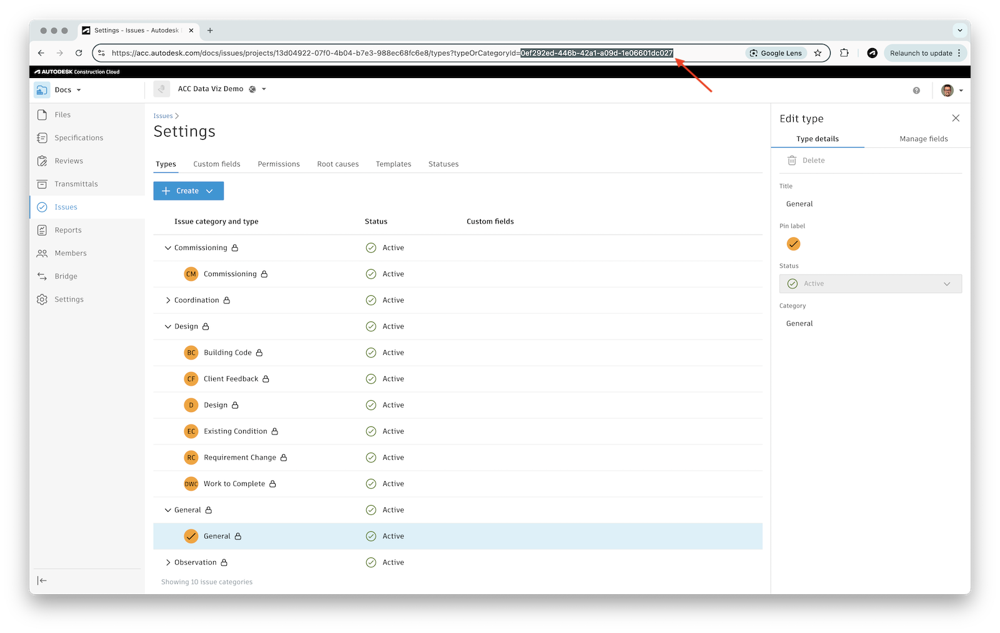

# Create Simple Flow

In this tutorial, we will walk through the process of creating a simple Power Automate flow that will:

- Trigger whenever a new design is added to a specific folder in [Autodesk Construction Cloud](https://construction.autodesk.com)
- Check names of all design views, and create an issue in Autodesk Construction Cloud if any of the 3D views has the default name `{3D}`
- Send an email with information about all the views

!> This tutorial assumes that you have already created or imported custom connectors described in previous tutorials.

## Create a flow

- In Power Automate, create a new flow by clicking **Create** in the left sidebar, and selecting **Automated cloud flow**

- In the **Build an automated cloud flow** dialog that pops up, click **Skip** to go straight to the flow designer

## Add a trigger

First we create a trigger that will start our flow whenever a design is added to our ACC project. We will also extract the URN of the added design, and save it in a variable for later use.

> ### Tip: Folder URN
>
> In this section we will need a _URN_ of a folder in ACC that will be monitored for changes. For simple experiments you can get the folder URN from https://acc.autodesk.com:
>
> - Go to your ACC project, and select the folder you want to monitor
> - Grab the **folderUrn** query parameter from the URL
> - URL-decode it (for example, using https://www.urldecoder.org)
> - After decoding the URN should look something like this: `urn:adsk.wipprod:fs.folder:...`
>
> 

- In the flow designer, click the **Add a trigger** block
- In the **Add a trigger** panel, search for `design added`, set the filter under the search field to **Custom**, and select the **When new design version is added** trigger

> Note: if this is the first time you're using the custom connector, Power Automate will ask you to sign in. In that case simply log in with your Autodesk account.

- In the **When new design version is added** configuration panel, add the following details:
  - **Folder URN**: a URN of one of your folders in ACC

- In the flow editor, click the plus icon under the **When new design version is added** trigger to add an action
- In the **Add an action** panel, search for `initialize variable`, and select the **Initialize variable** action
- Set the following details in the **Initialize variable** panel:
  - **Name**: `urn`
  - **Type**: **String**
  - **Value**: click inside the input field, then click the small **fx** icon next to it, enter the expression `replace(base64(triggerOutputs()?['body/resourceUrn']),'/','_')`, and click **Add**

    > Note: this expression extracts the `resourceUrn` field from our webhook trigger, base64-encodes it, and replaces any `/` characters with `_`; the result is the URN that we can later use when sending requests to the Model Derivative service.

  - Click the **Initialize variable** title in the top-left, and rename it to `Extract model URN`

## Retrieve model views

Next, let's add a small piece of logic that will wait until the design file has been fully processed, and then save the list of all views in another variable.

- In the flow editor, click the plus icon under the **Extract model URN** block, and add a **Do until** action
- Inside the **Do until** block in the flow editor, click the plus icon, add a **Delay** action, and configure it with:
  - **Count**: `30`
  - **Unit**: **Second**
  - Click the **Delay** title in the top-left, and rename it to `Wait 30 seconds`
- In the flow editor, click the plus icon under the **Wait 30 seconds** block, add a **List model views** action, and configure it with:
  - **Urn**: click the small lightning icon, and select the `urn` variable we initialized earlier
- Select the **Do until** block, and configure it with:
  - **Loop until**: click inside the input field, then click the small **fx** icon next to it, enter the expression `outputs('List_model_views')?['statusCode']`, and click **Add**

    > Note: this expression will extract the `statusCode` field from the output of the previous action (**List model views**).

  - **is equal to** `200`
  - **Count**: 10

- Click the plus icon under the **Do until** block, add an **Initialize variable** action, and configure it with:
  - **Name**: `views`
  - **Type**: **Array**
  - **Value**: click inside the input field, then click the small lightning icon next to it, and select the `body/data/metadata` field (from the **List model views** action)
    - Alternatively, you could use the **fx** icon, and enter the expression `outputs('List_model_views')?['body/data/metadata']`
  - Click the **Initialize variable** title in the top-left, and rename it to `Extract model views`

## Check view names

- Click the plus icon under the **Extract model views** block, add an **Apply to each** action, and configure it with:
  - **Select an output from previous steps**: click inside the input field, then click the small lightning icon next to it, and select the `views` variable we initialized earlier
    - Alternatively, you could use the **fx** icon, and enter the expression `variables('views')`
  - Click the **Apply to each** title in the top-left, and rename it to `For each view`

- Inside the **Apply to each** block, click the plus icon, add a **Condition** action, and configure it with:
  - **Choose a value**: click the small **fx** icon, enter the expression `item()?['name']`, and click **Add**

    > Note: this expression will simply extract the `name` field of every item from the collection being iterated over.

  - **is equal to** `{3D}`
  - Click the **Condition** title in the top-left, and rename it to `Has default name`

## Create an issue

> ### Tip: Issue Subtype ID
>
> In this section we will need an _issue subtype ID_. For simple experiments you can get the ID from https://acc.autodesk.com:
>
> - Go to your ACC project, and head over to the **Issues** section
> - Expand the **Settings** dropdown on the right side, and click **Types**
> - Select one of the issue types, for example, **General**
> - Grab the **typeOrCategoryId** query parameter from the URL
> 

- Inside the **True** branch of the **Has default name** block, click the plus icon, add a **Create issue** action from our custom connector (don't forget to enable the **Custom** filter), and configure it with:
  - **ProjectId**: click the small lightning icon, and add the `body/payload/project` field (from the **When new design version is added** trigger)
  - **Issue Definition/title**: `3D view must not have default name`
  - **Issue Definition/issueSubtypeId**: ID of an issue subtype in ACC
  - **Issue Definition/status**: `open`

## Send an e-mail

- Click the plus icon under the **For each view** block, add a **Send an email notification (V3)** action, and configure it with:
  - **To**: your e-mail address
  - **Subject**: `Design has been added`
  - **Body**: enter `Views: `, then click the **fx** icon, enter the expression `variables('views')`, and click **Add**

- Click **Save** in the top-right to save the flow, and then **Back** in the top-left to go back to the flow overview

## Try the flow

Go to your ACC project, upload a Revit file to the folder you've configured in the trigger, and an e-mail should arrive shortly after:

Also, if your Revit file has at least one 3D view called `{3D}`, you should see a new issue in ACC:

> Note: if you haven't received the e-mail, check the **Flow runs** in your flow overview page. If the flow run failed, open it (by clicking the timestamp of the run), and investigate the individual steps of the flow.
> 