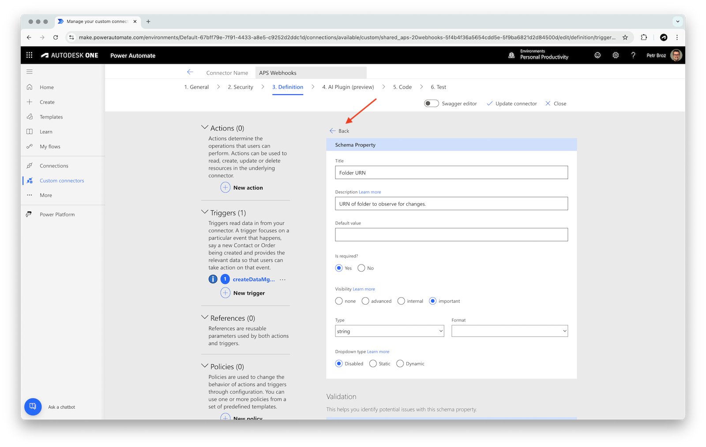

# Create Connector for Webhooks

In this tutorial, we will create a custom Power Automate connector for Autodesk Platform Services [Webhooks API](https://aps.autodesk.com/en/docs/webhooks/v1/developers_guide/overview/). You'll learn how to:

- Set up a new custom connector from scratch in Power Automate
- Configure OAuth 2.0 authentication for secure access to APS APIs
- Define a webhook trigger that listens for new design versions added in [Autodesk Construction Cloud](https://construction.autodesk.com) projects
- Build a simple flow that sends an email notification when a new design version is detected

By the end of this guide, you'll have a working connector and flow that can help automate notifications and integrate APS events into your business processes.

> ### Sidenote
>
> #### Why not just import OpenAPI specs?
>
> As we go through the process of creating custom connectors, you'll see that Power Automate provides ways to _generate_ connectors from existing definitions, for example, from OpenAPI specs or Postman collections. While we _do_ provide [OpenAPI specs](https://aps.autodesk.com/blog/openapi-specs-are-here) and [Postman collections](https://github.com/autodesk-platform-services/aps-postman-collections) for APS, the automated connector generation has various limitations, for example:
>
> - According to the [custom connectors docs](https://learn.microsoft.com/en-us/connectors/custom-connectors/define-openapi-definition), when importing OpenAPI specifications, only the _OpenAPI 2.0_ format (formerly known as _Swagger_) is supported
>   - Downgrading OpenAPI 3.0 to OpenAPI 2.0 is not trivial
> - According to an [announcement from October 2022](https://learn.microsoft.com/en-us/power-platform-release-plan/2022wave1/power-platform-pro-development/openapi-3-support-custom-connectors), _OpenAPI 3.0_ is also supported
>   - Apparently, when importing an OpenAPI 3.0 specification, Power Automate attempts to downgrade it to OpenAPI 2.0
>   - Unfortunately we've often seen this process fail or generate invalid output
> - When importing Postman collections, some information is lost or changed during the process
>   - For example, response fields that should be numbers are turned to strings, causing validation errors during runtime
> - There are important [extensions](https://learn.microsoft.com/en-us/connectors/custom-connectors/openapi-extensions) that still need to be added to the specification to make the best use of the Power Automate capabilities
>
> Because of these limitations, this tutorial currently focuses on creating Power Automate connectors from scratch.

## Create a connector

Let's start by creating a blank custom connector, and configure its authentication for access to Autodesk Platform Services.

- In Power Automate, go to **Custom connectors** in the left sidebar, and in the **New custom connector** dropdown in the top-right, select **Create from blank**


> Note: if you don't see **Custom connectors** in the sidebar, use the **Discover all** button (under the **... More** sidebar menu) to find and pin them:
> 

- In the **Create from blank** dialog, enter a name for the connector (for example, `APS Webhooks`), and click **Continue**
- In the **1. General** step, under **General information**, enter the following details:
  - **Scheme**: `HTTPS`
  - **Host**: `developer.api.autodesk.com`
  - **Base URL**: `/webhooks/v1`
  - Optionally, specify the icon and description for your connector as well
- Click **Security** at the bottom-right to go to the next step


- In the **2. Security** step, set **Authentication type** to **OAuth 2.0**
- In the **OAuth 2.0** panel, enter the following details:
  - **Identity Provider**: **Generic Oauth 2**
  - **Client ID**: your APS client ID
  - **Client Secret**: your APS client secret
  - **Authorization URL**: `https://developer.api.autodesk.com/authentication/v2/authorize`
  - **Token URL**: `https://developer.api.autodesk.com/authentication/v2/token`
  - **Refresh URL**: `https://developer.api.autodesk.com/authentication/v2/token`
  - **Scope**: `data:read, data:write`
- Click **Create connector** in the top-right to save the connector


- After the connector has been created, copy the auto-generated **Redirect URL** at the very bottom of the **OAuth 2.0** panel (should look something like this: `https://global.consent.azure-apim.net/redirect/...`), and register it as a callback URL for your APS application on https://aps.autodesk.com/myapps


## Add a trigger

Next, we'll add a _trigger_ to our custom connector which can later be used to trigger Power Automate flows. In our case the trigger will use [Webhooks API](https://aps.autodesk.com/en/docs/webhooks/v1/developers_guide/overview/) to create a webhook that will notify the Power Automate platform whenever a new design version is added in our Data Management service (see [dm.version.added](https://aps.autodesk.com/en/docs/webhooks/v1/reference/events/data_management_events/dm.version.added/)).

- Go to the **3. Definition** step in the connector configurator, and click **New Trigger**


- In the **General** panel, enter the following details:
  - **Summary**: `When new design version is added`
  - **Description** (optional): `Create a webhook that triggers when new design version is added in the Data Management service.`
  - **Operation ID**: `createDataMgmtVersionAddedWebhook`
  - **Visibility**: **important**
  - **Trigger type**: **Webhook**


- In the **Request** section, click **Import from sample**
- In the **Import from sample** panel that slides in from the right, enter the following details:
  - **Verb**: **POST**
  - **URL**: `https://developer.api.autodesk.com/webhooks/v1/systems/data/events/dm.version.added/hooks`
  - **Headers**: `Content-Type application/json`
  - **Body**: add the following payload example (a simplified version of the payload example from the [documentation](https://aps.autodesk.com/en/docs/webhooks/v1/reference/http/webhooks/systems-system-events-event-hooks-POST/#example)):

```js
{
  "callbackUrl": "http://bf067e05.ngrok.io/callback",
  "scope": {
    "folder": "urn:adsk.wipprod:fs.folder:co.wT5lCWlXSKeo3razOfHJAw"
  }
}
```

- Click **Import**


- In the **Webhook Response** panel, set the **Description** to `New design version has been added.`, and click **Import from sample**
- In the **Import from sample** panel that slides in from the right, enter the following details:
  - **Body**: add the following payload example (taken from the [dm.version.added](https://aps.autodesk.com/en/docs/webhooks/v1/reference/events/data_management_events/dm.version.added/) event documentation):

```js
{
  "version": "1.0",
  "resourceUrn": "urn:adsk.wipprod:fs.file:vf.0zvdp3CoTzWDcZC_wL0kJA?version=1",
  "hook": {
    "system": "data",
    "event": "dm.version.added",
    "hookId": "1fcd3e30-9f3f-11e7-951f-0fd5337ed5ce",
    "tenant": "urn:adsk.wipprod:fs.folder:co.s424tpjyS_yYBs5ozch94g",
    "callbackUrl": "http://bf067e05.ngrok.io/callback",
    "createdBy": "*************",
    "createdDate": "2017-09-22T02:38:32.341+0000",
    "creatorType": "Application",
    "filter": "$[?(@.ext=='txt')]",
    "hookAttribute": {
      "myfoo": 34,
      "projectId": "someURN",
      "myobject": {
        "nested": true
      }
    },
    "scope": {
      "folder": "urn:adsk.wipprod:fs.folder:co.s424tpjyS_yYBs5ozch94g"
    },
    "urn": "urn:adsk.webhooks:events.hook:1fcd3e30-9f3f-11e7-951f-0fd5337ed5ce",
    "status": "active",
    "__self__": "/systems/data/events/dm.version.added/hooks/1fcd3e30-9f3f-11e7-951f-0fd5337ed5ce"
  },
  "payload": {
    "ext": "txt",
    "modifiedTime": "2017-09-06T03:08:53+0000",
    "creator": "*************",
    "lineageUrn": "urn:adsk.wipprod:dm.lineage:0zvdp3CoTzWDcZC_wL0kJA",
    "sizeInBytes": 36,
    "hidden": false,
    "indexable": true,
    "project": "4f8b8b74-3853-473d-85c4-4e8a8bff885b",
    "source": "urn:adsk.wipprod:fs.file:vf.0zvdp3CoTzWDcZC_wL0kJA?version=1",
    "version": "1",
    "user_info": {
      "id": "*************"
    },
    "name": "dc829fc5-bd21-4444-8d8f-735ae4fe736f.txt",
    "createdTime": "2017-09-06T03:08:53+0000",
    "modifiedBy": "*************",
    "state": "CONTENT_AVAILABLE",
    "parentFolderUrn": "urn:adsk.wipprod:fs.folder:co.chOa5mlkR6mjN-PEx8-r8Q",
    "ancestors": [
      {
        "urn": "urn:adsk.wipprod:fs.folder:co.woxoClweRCeMWn-HFbXGdQ",
        "name": "b662c88c-85e3-45c7-a9cc-6c77a31462a4"
      },
      {
        "urn": "urn:adsk.wipprod:fs.folder:co.XFrPsQGxRomOJzyL1-z7Tg",
        "name": "292139e5-5f7f-402c-90f0-e61b53f38aad-account-root-folder"
      },
      {
        "urn": "urn:adsk.wipprod:fs.folder:co.6a5Ylw9mRDus2bhttmH7dw",
        "name": "4f8b8b74-3853-473d-85c4-4e8a8bff885b-root-folder"
      },
      {
        "urn": "urn:adsk.wipprod:fs.folder:co.bXJiDx2ySve30xhul5Ihuw",
        "name": "Project Files"
      },
      {
        "urn": "urn:adsk.wipprod:fs.folder:co.chOa5mlkR6mjN-PEx8-r8Q",
        "name": "SomeTest"
      }
    ],
    "tenant": "292139e5-5f7f-402c-90f0-e61b53f38aad"
  }
}
```

- Click **Import**


- In the **Trigger configuration** panel, set the **Callback URL parameter** to **callbackUrl**


- Go back to the **Request** panel
- In the **Request > Headers** section, click the **Content-Type** dropdown, and select **Edit**
- Update the following parameter details:
  - **Default value**: `application/json`
  - **Is required?**: **Yes**
  - **Visibility**: **internal**
- Go back to the trigger configuration by clicking the **Back** link at the top


- In the **Request > Body** section, click the **body** dropdown, and select **Edit**
- Update the following parameter details:
  - **Name** (optional): `Webhook Definition`
  - **Is required?**: **Yes**
  - **Visibility**: **important**


- Click the **callbackUrl** dropdown, and select **Edit**
- Update the following parameter details:
  - **Title**: `Callback URL`
  - **Description** (optional): `URL to be called by the webhook when it triggers.`
  - **Is required?**: **Yes**
  - **Visibility**: **internal**
- Go back to the body parameter configuration by clicking the **Back** link at the top


- Similarly, click the **folder** dropdown, and select **Edit**
- Update the following parameter details:
  - **Title**: `Folder URN`
  - **Description** (optional): `URN of folder to observe for changes.`
  - **Is required?**: **Yes**
  - **Visibility**: **important**
- Go back to the body parameter configuration by clicking the **Back** link at the top



- Save the configured trigger by clicking the **Update connector** button in the top-right

## Create a test flow

Now that we have a usable trigger in our custom connector, let's try it out in a simple Power Automate flow.

- In Power Automate, create a new flow by clicking **Create** in the left sidebar, and selecting **Automated cloud flow**


> Note: if a **Build an automated cloud flow** dialog pops up, click **Skip** to go straight to the flow designer.

- In the flow designer, click on the **Add a trigger** block
- In the **Add a trigger** panel that slides in from the left, search for `design added`, set the filter under the search field to **Custom**, and select the **When new design version is added** trigger


> Note: if this is the first time you're using the custom connector, Power Automate will ask you to sign in. Click **Sign in**, and log in with your Autodesk account.

- In the **When new design version is added** configuration panel, add the following details:
  - **Folder URN**: a URN of one of your folders in ACC


> Tip: for simple experiments you can get the folder URN from [Autodesk Construction Cloud](https://acc.autodesk.com). Go to your ACC project, navigate to one of the folders, grab the **folderUrn** query parameter, and url-decode it (for example, using https://www.urldecoder.org/). The url-decoded folder URN should look something like this: `urn:adsk.wipprod:fs.folder:...`.
> 

- Click on the plus icon under the trigger to add an action
- In the **Add an action** panel that slides in from the left, search for `email`
- Select the **Send an email notification (V3)** action


- In the **Send an email notification (V3)** configuration panel, add the following details:
  - **To**: your e-mail address
  - **Subject**: `Design has been added`
  - **Body**: `New design version has been added: `
- With the cursor still in the **Body** text field, click the little lightning bolt icon (or type in `/`) to add dynamic content


- In the popup, search for `name`, and select **body/payload/name**, effectively extracting the name of the new design from our trigger


- Click **Save** in the top-right to save the flow, and then **Back** in the top-left to go back to the flow overview

## Try it out

Go to your ACC project, upload a file to the folder you've configured in the trigger, and an e-mail should arrive shortly after.


> Note: if you haven't received the e-mail, check the **Flow runs** in your flow overview page. If the flow run failed, open it (by clicking the timestamp of the run), and investigate the individual steps of the flow.
> 