# Import Existing Connectors

In this tutorial, we will import a custom Power Automate connector for Autodesk Platform Services [Model Derivative API](https://aps.autodesk.com/en/docs/model-derivative/v2/developers_guide/overview/) from an existing OpenAPI specification (YAML file). You'll learn how to:

- Import the connector into Power Automate using an OpenAPI URL
- Configure authentication with OAuth 2.0 for access to APS
- Review and understand the available actions in the connector
- Test the connector by listing model views and element properties

By the end of this tutorial, you'll have a working custom connector that enables you to automate design data workflows with Autodesk Platform Services.

## Import a connector

- In Power Automate, go to **Custom connectors** in the left sidebar, and in the **New custom connector** dropdown in the top-right, select **Import an OpenAPI from URL**

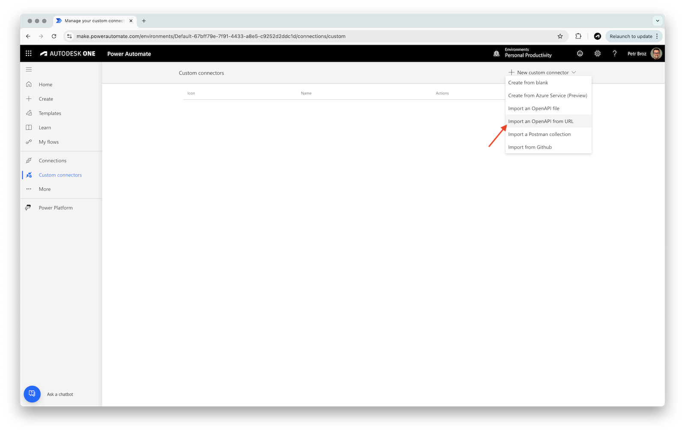

> Note: if you don't see **Custom connectors** in the sidebar, use the **Discover all** button (under the **... More** sidebar menu) to find and pin them:
> 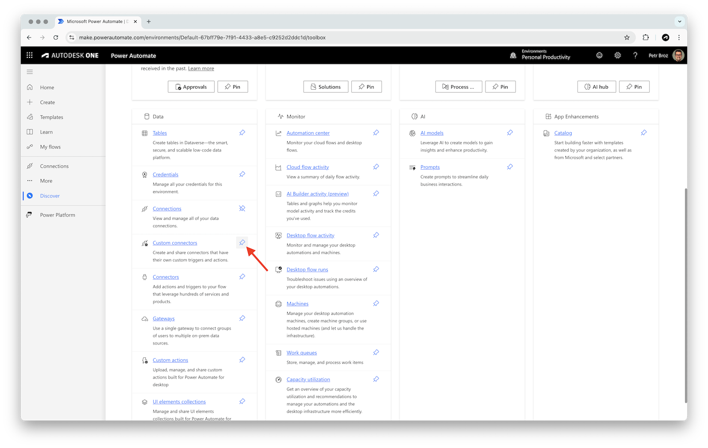

- In the **Import an OpenAPI from URL** dialog, enter the following details:
  - **Connector name**: a name for the connector (for example, `APS Model Derivative`)
  - **Paste in the URL for the OpenAPI**: `https://raw.githubusercontent.com/autodesk-platform-services/aps-power-automate-tools/refs/heads/master/connectors/model-derivative.yaml`
- Click **Import** to import and validate the OpenAPI spec, and then click **Continue**

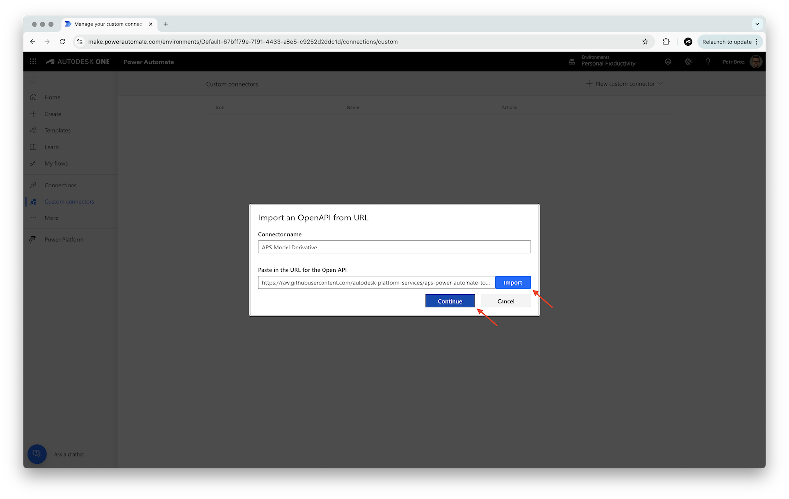

## Setup authentication

- In the **2. Security** step, set **Authentication type** to **OAuth 2.0**
- In the **OAuth 2.0** panel, enter the following details:
  - **Identity Provider**: **Generic Oauth 2**
  - **Client ID**: your APS client ID
  - **Client Secret**: your APS client secret
  - **Authorization URL**: `https://developer.api.autodesk.com/authentication/v2/authorize`
  - **Token URL**: `https://developer.api.autodesk.com/authentication/v2/token`
  - **Refresh URL**: `https://developer.api.autodesk.com/authentication/v2/token`
  - **Scope**: `data:read`
- Click **Create connector** in the top-right to save the connector

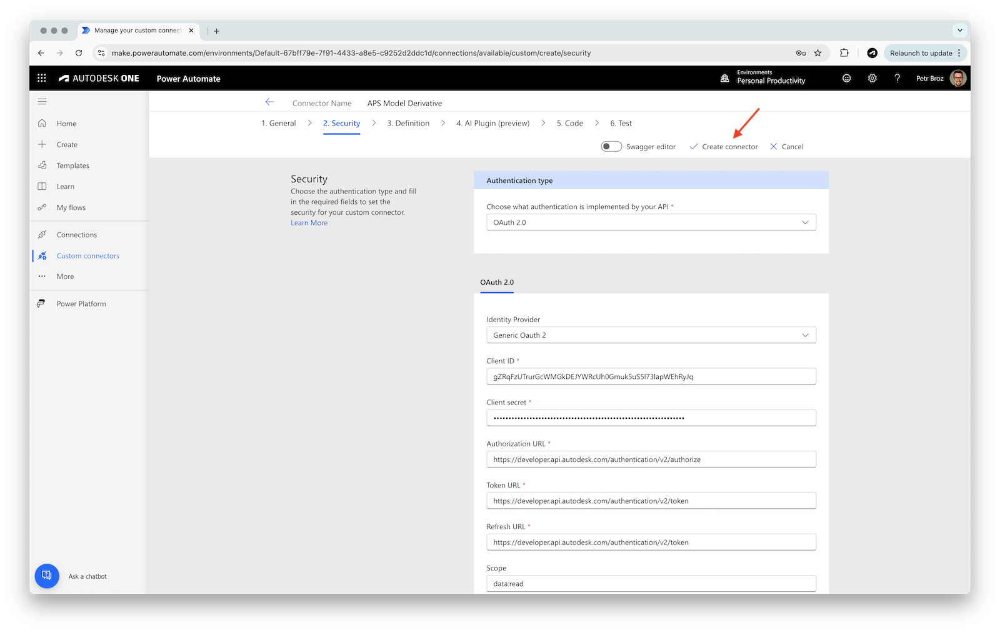

- After the connector has been created, copy the auto-generated **Redirect URL** at the very bottom of the **OAuth 2.0** panel (should look something like this: `https://global.consent.azure-apim.net/redirect/...`), and register it as a callback URL for your APS application on https://aps.autodesk.com/myapps

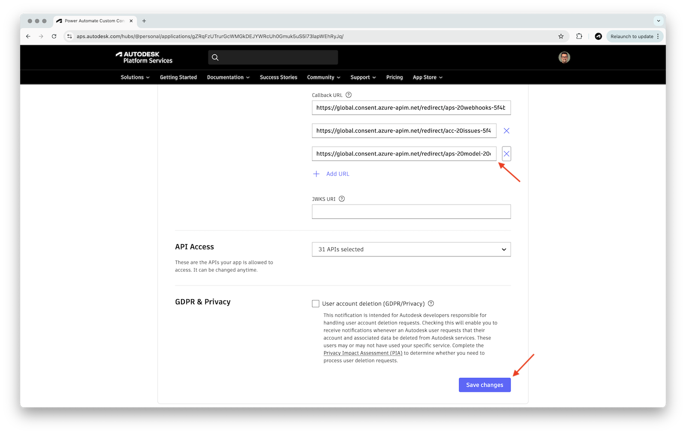

## Review the actions

- In the **3. Definition** step you should see two actions
  - **listModelViews** - this action lists all _views_ (also called _viewables_) extracted from a specific _model_ by the Model Derivative service
  - **listElementProperties** - this action lists all _properties_ within a specific _model viewable_

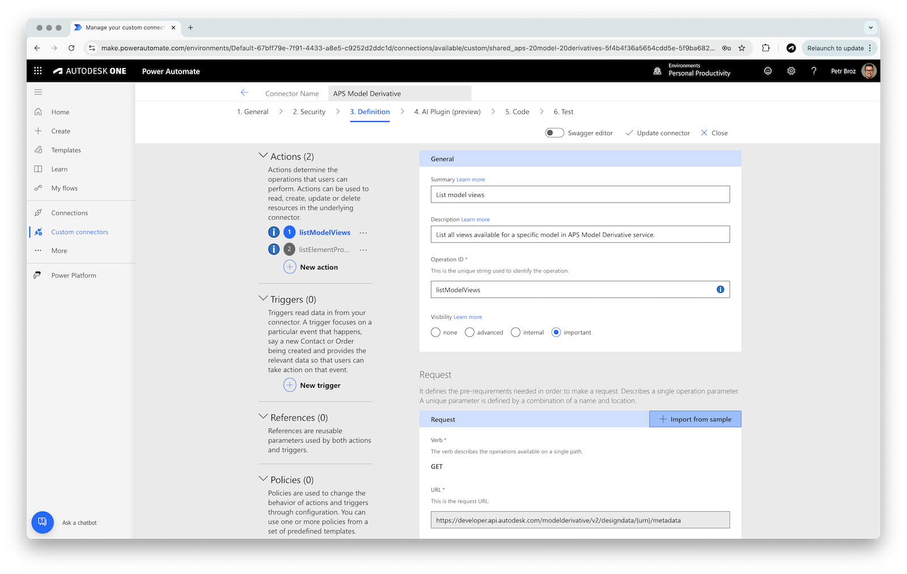

## Test the connector

> ### Tip: Retrieving model URN
>
> In the following tests we will need a _model URN_ (a base64-encoded ID of a design stored in our Data Management service). For simple experiments you can get the URN from https://acc.autodesk.com:
>
> - Go to your ACC project, and open one of the designs
> - Open the developer console in your browser (typically `Ctrl+Shift+J` on Windows/Linux, or `Cmd+Option+J` on Mac)
> - Execute the following command in the console: `NOP_VIEWER.model.getData().urn`
> - Copy the URN (without the quotes)
>
> 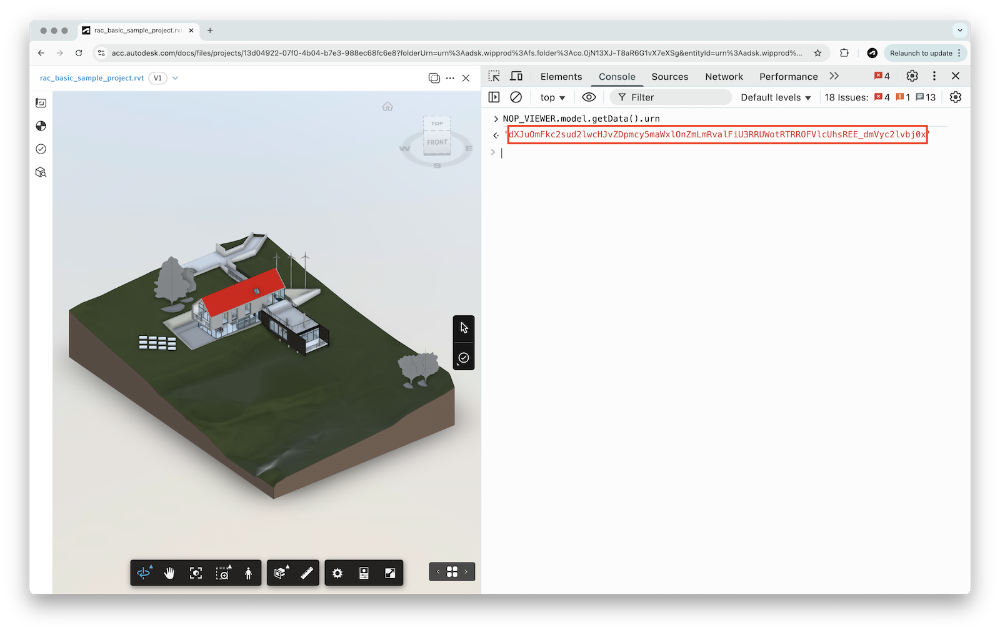

- Go to the **6. Test** step in the connector configurator
- If you don't have an existing connection in the **Connections** panel, click **New connection**, and login with your Autodesk credentials

### Listing model views

- In the **Operations** section, select **listModelViews**, and specify the following inputs:
  - **urn**: your model URN
- Finally, click **Test operation**

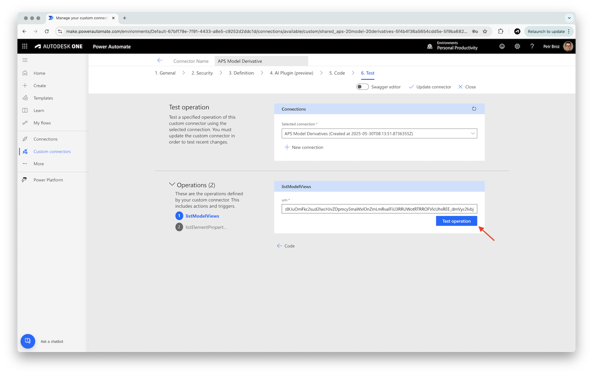

- The test operation should succeed, giving you a list of model views
- Make note of one of the view GUIDs - we will use them in the next test

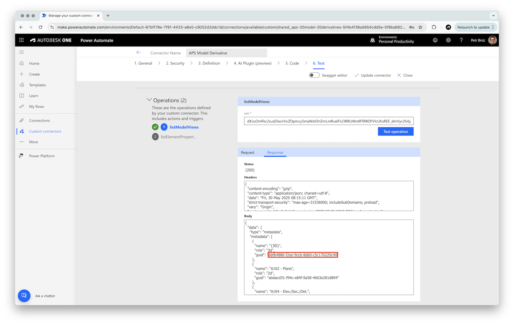

### Listing element properties

- In the **Operations** section, select **listElementProperties**
- In the **listElementProperties** panel, specify the following inputs:
  - **urn**: base64-encoded ID of a design
  - **modelGuid**: GUID of a model view retrieved from the previous test
- Finally, click **Test operation**

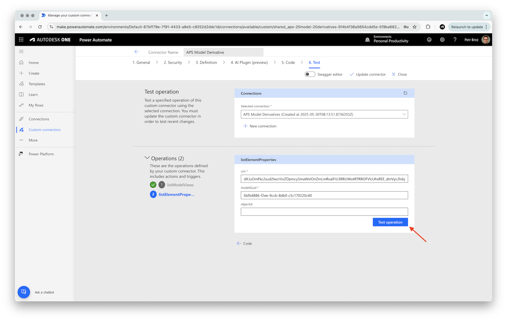

- The test operation should succeed, giving you a list of all element properties

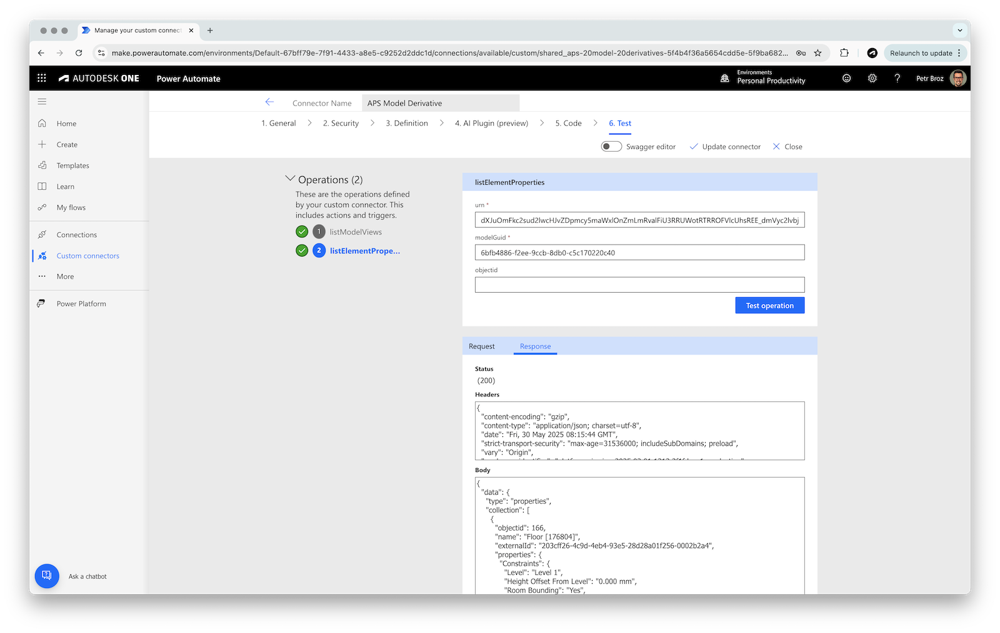